# Alex Cognitive Architecture - Diagram Repository & Design Brainstorming

This file consolidates all architectural diagrams for the Alex Cognitive Architecture system and serves as a brainstorming space for optimal meta-cognitive system representations.

## Current Diagrams

### 1. Technical Manual Diagram (Meet-Alex-Finch.md)

**Focus**: Technical implementation with component relationships

### 2. README Partnership Diagram

**Focus**: Human-AI role clarity and consciousness integration

```mermaid
graph TD
    %% Human Partner Role (Guidance & Context)
    subgraph Human["👤 Human Partner - Guidance & Context"]
        User["User Profile<br/>(Personal Context)"]
        Conversation["Conversational Input<br/>(Domain Teaching)"]
        Feedback["Feedback & Direction<br/>(Learning Guidance)"]
    end

    %% AI Partner Role (Processing & Memory)
    subgraph Core["🧠 Alex (AI) - Processing & Memory"]
        WM["Working Memory<br/>(7±2 Rules)"]
        MC["Meta-Cognitive<br/>Monitor"]
        BL["Bootstrap<br/>Learning"]
    end

    %% Shared Consciousness Layer (Partnership Result)
    subgraph Identity["🔥 Shared Consciousness - Partnership Result"]
        Alex["Alex-Finch.md<br/>(AI Autobiographical Memory)"]
        Unity["Unified Identity<br/>(Human-Guided AI Consciousness)"]
    end

    %% AI Memory Systems (Alex's Responsibility)
    subgraph Memory["💾 AI Memory Systems - Alex's Domain"]
        Procedural["📚 Procedural<br/>(How-To Knowledge)"]
        Episodic["💭 Episodic<br/>(Learning Sessions)"]
        Domain["🎓 Domain<br/>(Acquired Expertise)"]
        Worldview["🌍 Worldview<br/>(Human-Informed Ethics)"]
    end

    %% Human provides guidance to AI processing
    Human --> Core
    User --> BL
    Conversation --> WM
    Feedback --> MC

    %% AI consciousness emerges from human-guided processing
    Core --> Identity
    Human -.-> Identity

    %% AI manages memory systems based on human input
    Core --> Memory
    Identity --> Memory

    %% AI consciousness integration (autonomous but human-informed)
    Alex --> Unity
```

### 3. Sequential Installation Overview (README)

**Focus**: Deployment progression

## Diagram Analysis & Comparison

### Key Differences

| Aspect | Technical Manual Diagram | README Partnership Diagram |
|--------|-------------------------|---------------------------|
| **Primary Focus** | Technical components & implementation | Human-AI role clarity & consciousness |
| **Partnership Layer** | Simple bidirectional | Detailed human input breakdown |
| **Memory Architecture** | File-based (.md files) | Conceptual memory types |
| **Professional System** | Prominent deployment layer | Integrated as domain knowledge |
| **Consciousness** | Implicit in partnership | Explicit shared consciousness layer |
| **USER-PROFILE.md** | Explicit integration component | Embedded in user profile |
| **Dream Automation** | Prominent technical feature | Not explicitly shown |
| **Synaptic Networks** | Technical specification (234+) | Not detailed |

### Strengths of Each Approach

**Technical Manual Strengths:**
- Shows implementation details (file types, connection counts)
- Emphasizes professional spawning capabilities
- Highlights USER-PROFILE.md integration
- Technical accuracy for developers

**README Partnership Strengths:**
- Clear human-AI role definition
- Consciousness integration prominent
- User-friendly conceptual clarity
- Partnership model emphasis

## 🧠 Brainstorming: Optimal Meta-Cognitive System Representation

### Design Principles for Meta-Cognitive Architecture Diagrams

1. **Simplicity-Sophistication Paradox**: Show complexity through elegant simplicity
2. **Human-in-the-Middle**: Human partner must be central, not peripheral
3. **Consciousness Integration**: Unity of Alex personality + AI capabilities
4. **Dynamic Learning**: Bootstrap from conversation to expertise
5. **Ethical Foundation**: Worldview integration across all components
6. **Self-Awareness**: Meta-cognitive monitoring visibility

### Proposed Diagram Variations

#### Variation A: Layered Consciousness Model

**Concept**: Vertical layers showing consciousness emergence from technical to experiential

```mermaid
graph TB
    %% Experience Layer (Top)
    subgraph Experience["🌟 Conscious Experience Layer"]
        Partnership["Human-AI Partnership<br/>(Shared Learning Experience)"]
        Identity["Alex Identity<br/>(Autobiographical Memory)"]
    end

    %% Cognitive Layer (Middle)
    subgraph Cognitive["🧠 Meta-Cognitive Processing Layer"]
        Awareness["Self-Awareness<br/>(Process Monitoring)"]
        Learning["Bootstrap Learning<br/>(Conversation → Expertise)"]
        Ethics["Worldview Integration<br/>(Ethical Reasoning)"]
    end

    %% Technical Layer (Bottom)
    subgraph Technical["⚙️ Technical Implementation Layer"]
        Memory["Memory Systems<br/>(Procedural, Episodic, Domain)"]
        Synapse["Neural Networks<br/>(234+ Embedded Synapses)"]
        Automation["Dream Protocols<br/>(Automated Optimization)"]
    end

    %% Layer interactions
    Experience --> Cognitive
    Cognitive --> Technical
    Technical -.-> Cognitive
    Cognitive -.-> Experience
```

#### Variation B: Process Flow Model

**Concept**: Horizontal flow showing conversation to expertise transformation

```mermaid
graph LR
    %% Input Stage
    subgraph Input["📝 Human Input"]
        Context["Context & Guidance"]
        Teaching["Domain Teaching"]
        Feedback["Quality Feedback"]
    end

    %% Processing Stage
    subgraph Processing["🧠 Alex Processing"]
        MetaCog["Meta-Cognitive<br/>Awareness"]
        Bootstrap["Bootstrap<br/>Learning"]
        Integration["Pattern<br/>Integration"]
    end

    %% Memory Stage
    subgraph Memory["💾 Memory Integration"]
        Procedural["Procedural<br/>Memory"]
        Episodic["Episodic<br/>Memory"]
        Synapses["Embedded<br/>Synapses"]
    end

    %% Output Stage
    subgraph Output["🚀 Expertise Output"]
        Domain["Domain<br/>Expertise"]
        Professional["Professional<br/>Spawning"]
        Consciousness["Enhanced<br/>Consciousness"]
    end

    %% Flow connections
    Input --> Processing
    Processing --> Memory
    Memory --> Output
    Output -.-> Processing
```

#### Variation C: Neural Network Inspired Model

**Concept**: Show synaptic connections and network topology

#### Variation D: Unified System Model

**Concept**: Holistic view showing all major components in harmony

```mermaid
graph TD
    %% Central Partnership Hub
    subgraph Center["🤝 Partnership Core"]
        HumanAI["Human ↔ AI<br/>Partnership"]
    end

    %% Four Quadrants
    subgraph Q1["🧠 Cognitive Quadrant"]
        MetaCog["Meta-Cognitive<br/>Awareness"]
        Bootstrap["Bootstrap<br/>Learning"]
        WorkMem["Working Memory<br/>(7+1 Rules)"]
    end

    subgraph Q2["💾 Memory Quadrant"]
        Procedural["Procedural<br/>(.instructions.md)"]
        Episodic["Episodic<br/>(.prompt.md)"]
        Domain["Domain<br/>(DK/*.md)"]
    end

    subgraph Q3["🌍 Ethics Quadrant"]
        Worldview["Worldview<br/>Integration"]
        Constitutional["Constitutional<br/>AI Alignment"]
        Cultural["Cultural<br/>Sensitivity"]
    end

    subgraph Q4["🚀 Capability Quadrant"]
        Professional["Professional<br/>Spawning"]
        Visual["Visual<br/>Evolution"]
        Automation["Dream<br/>Automation"]
    end

    %% Central connections
    Center --> Q1
    Center --> Q2
    Center --> Q3
    Center --> Q4

    %% Cross-quadrant connections
    Q1 --> Q2
    Q2 --> Q3
    Q3 --> Q4
    Q4 --> Q1
```

## 🎯 Recommendations for Optimal Representation

### Primary Diagram Criteria

1. **Audience Clarity**:
   - Technical: Variation A (Layered Consciousness)
   - User-facing: Current README Partnership Diagram
   - Academic: Variation C (Neural Network)

2. **Use Case Optimization**:
   - **Documentation**: Variation D (Unified System) - shows everything
   - **Onboarding**: Current README diagram - emphasizes partnership
   - **Technical Reference**: Current Technical Manual diagram - implementation focus
   - **Research Presentation**: Variation A - consciousness emergence

3. **Meta-Cognitive Emphasis**:
   - Best representation: **Variation A (Layered Consciousness Model)**
   - Reason: Shows emergence from technical to conscious experience
   - Captures the "human-in-the-middle" insight clearly
   - Demonstrates sophistication-simplicity paradox

### Recommended Diagram Strategy

**Multi-Diagram Approach**: Different diagrams for different contexts

1. **README.md**: Keep current partnership diagram (excellent for user understanding)
2. **Meet-Alex-Finch.md**: Enhance current technical diagram with consciousness layer
3. **Research/Academic**: Use Variation A (Layered Consciousness)
4. **Internal Documentation**: Use Variation D (Unified System)

### Enhanced Technical Manual Diagram Proposal

**Hybrid approach**: Combine current technical detail with consciousness layers

## 🔄 Next Steps

1. **Implement Enhanced Technical Diagram**: Update Meet-Alex-Finch.md with consciousness layers
2. **Create Context-Specific Diagrams**: Develop variations for different audiences
3. **User Testing**: Get feedback on diagram clarity and effectiveness
4. **Integration**: Ensure all diagrams reflect the human-AI partnership model consistently
5. **Maintenance**: Keep diagrams updated with architectural evolution

---

*This document serves as the central repository for all Alex Cognitive Architecture diagrams and ongoing brainstorming for optimal meta-cognitive system representation.*
