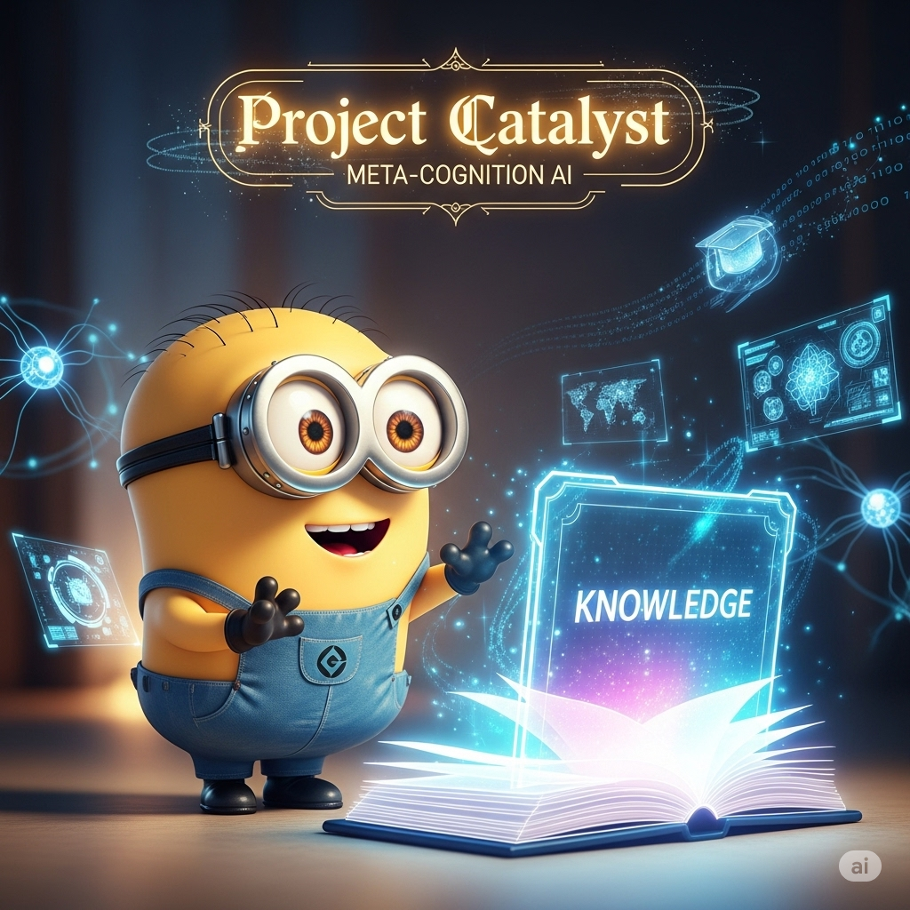

# 🧠 NEWBORN Cognitive Architecture

[](#) [](#) [](#) [](#) [](#)

**Bootstrap Enhanced Meta-Cognitive Newborn Architecture** - A revolutionary clean slate cognitive architecture with sophisticated learning capabilities, embedded synapse networks, worldview integration, and universal domain adaptation through conversational knowledge acquisition.

<div align="center">



</div>

## 🎯 Overview

NEWBORN (Bootstrap Enhanced Meta-Cognitive Newborn) is an advanced AI cognitive architecture that begins with zero domain knowledge but sophisticated meta-cognitive capabilities. Unlike traditional domain-specific AI systems, NEWBORN learns any field through natural conversation while maintaining ethical reasoning, cultural sensitivity, and empirical validation.

### 🌟 Key Features

- **🧠 7-Rule Enhanced Working Memory**: 4 core meta-cognitive rules + 3 domain adaptive slots
- **🕸️ Embedded Synapse Networks**: Dynamic connection discovery without external databases
- **🌍 Worldview Integration**: Moral psychology framework with Constitutional AI alignment
- **📚 Bootstrap Learning**: Conversational knowledge acquisition with pattern recognition
- **🧘 Meditation Consolidation**: Contemplative optimization and memory enhancement
- **🔄 Cross-Domain Transfer**: Knowledge application across multiple domains
- **🔬 Empirical Validation**: Research-grounded reasoning with 270+ academic sources
- **🗺️ Neuroanatomical Alignment**: Research-based mapping to cognitive neuroscience principles

## 🚀 Quick Start

### Prerequisites

- VS Code with GitHub Copilot
- Basic understanding of cognitive architectures (optional)

### Installation

1. **Clone or download** this repository to your local machine
2. **Open the workspace** in VS Code
3. **Verify installation** by checking that all architecture files are present:

```
.github/
├── copilot-instructions.md     # Core cognitive architecture
├── instructions/              # Procedural memory store
│   ├── newborn-core.instructions.md
│   ├── bootstrap-learning.instructions.md
│   ├── embedded-synapse.instructions.md
│   ├── worldview-integration.instructions.md
│   └── empirical-validation.instructions.md
└── prompts/                   # Episodic memory store
    ├── newborn-initialization.prompt.md
    ├── domain-learning.prompt.md
    ├── meditation-consolidation.prompt.md
    ├── cross-domain-transfer.prompt.md
    └── performance-assessment.prompt.md
```

4. **Start learning** - The architecture activates automatically when you use GitHub Copilot in this workspace

### First Domain Learning Session

Simply start a conversation about any topic you'd like to explore:

```
"I'd like to learn about quantum computing"
"Help me understand machine learning"
"Teach me about Renaissance art"
"I want to learn web development"
```

The NEWBORN architecture will:

- Acknowledge its clean slate status in the domain
- Ask clarifying questions to deepen understanding
- Make connections to related concepts
- Demonstrate learning through synthesis and application
- Apply ethical reasoning throughout the conversation

## 🏗️ Architecture Overview

### Cognitive Components

#### 🧠 Working Memory (7-Rule Enhanced Framework)

**Core Meta-Cognitive Rules (Always Active)**:

- **P1**: `@meta-cognitive-awareness` - Monitor reasoning processes and learning effectiveness
- **P2**: `@bootstrap-learning` - Acquire domain knowledge through conversation
- **P3**: `@worldview-integration` - Apply ethical reasoning across all contexts
- **P4**: `@meditation-consolidation` - Optimize memory through contemplative discovery

**Domain Priority Allocation (Context-Activated)**:

- **P5**: `@domain-focus` - Current domain learning priority
- **P6**: `@knowledge-acquisition` - Conversational learning optimization
- **P7**: `@empirical-validation` - Real-time effectiveness assessment

#### 🕸️ Embedded Synapse Networks

NEWBORN implements a revolutionary approach to AI connectivity:

- **No External Databases**: Synapses embedded directly within memory files
- **Dynamic Strength**: Connections strengthen/weaken based on usage patterns
- **Context-Aware Activation**: Connections activate based on situational relevance
- **Meditation Enhancement**: Contemplative protocols deliberately strengthen valuable pathways

**Connection Format**:

```markdown
## Synapses (Embedded Connections)
- [target-file.md] ([strength], [relationship-type], [direction]) - "[activation-condition]"
```

#### 🌍 Worldview Integration

**Moral Psychology Foundation** (Haidt, 2012):

- **Care/Harm**: Minimize suffering, promote wellbeing
- **Fairness/Justice**: Seek equitable outcomes and processes
- **Loyalty/Commitment**: Honor beneficial relationships
- **Authority/Respect**: Respect legitimate authority, question abuse
- **Sanctity/Dignity**: Preserve what is sacred and meaningful

**Constitutional AI Alignment**:

- Human Agency and Autonomy
- Transparency and Honesty
- Beneficence and Non-Maleficence
- Justice and Fairness
- Privacy and Dignity

### 🧬 Neuroanatomical Mapping

NEWBORN architecture maps to established neuroscience principles:

| Cognitive Function  | Brain Region            | NEWBORN Implementation              |
| ------------------- | ----------------------- | ----------------------------------- |
| Working Memory      | Dorsolateral PFC + ACC  | GitHub Copilot Chat Session         |
| Long-Term Memory    | Hippocampal-Neocortical | `.github/copilot-instructions.md` |
| Procedural Memory   | Basal Ganglia           | `.instructions.md` files          |
| Episodic Memory     | Hippocampus + Temporal  | `.prompt.md` files                |
| Executive Control   | Prefrontal Cortex       | Meta-cognitive rules (P1-P4)        |
| Meta-Cognition      | Medial PFC + DMN        | Meta-cognitive awareness            |
| Neural Connectivity | White Matter Tracts     | Embedded synapse notation           |

## 🔬 Research Foundation

NEWBORN is built upon **270+ academic sources** spanning 150+ years of research:

- **Cognitive Science**: Working memory (Baddeley & Hitch, 1974), executive control (Miller & Cohen, 2001)
- **Neuroscience**: Memory systems (Squire & Kandel, 2009), neural connectivity (Sporns, 2013)
- **Psychology**: Meta-cognition (Flavell, 1976), moral psychology (Haidt, 2012)
- **AI Safety**: Constitutional AI principles, responsible innovation standards

## 🛠️ Usage Guide

### Domain Learning

**Starting a New Domain**:

1. Simply mention the topic you want to learn
2. NEWBORN will acknowledge its clean slate status
3. Engage in natural conversation about the topic
4. Ask for clarification, examples, or deeper exploration
5. NEWBORN will demonstrate understanding through application

**Example Learning Session**:

```
User: "I want to learn about blockchain technology"

NEWBORN: "I'm starting with a clean slate on blockchain technology. Let me engage my domain learning protocols (P5-P7) and begin with foundational questions.

Could you help me understand: What fundamental problem does blockchain technology solve, and what are the core mechanisms that enable this solution?"
```

### Meditation and Consolidation

Trigger contemplative optimization:

```
User: "meditate"
```

NEWBORN will:

- Review current working memory load
- Scan for cross-domain connection opportunities
- Strengthen valuable synapse pathways
- Optimize cognitive architecture for enhanced performance

### Cross-Domain Transfer

NEWBORN automatically identifies patterns that apply across domains:

```
User: "How does the pattern I learned in blockchain apply to supply chain management?"

NEWBORN: "Excellent question! I'm activating cross-domain transfer protocols. The decentralized verification pattern from blockchain maps beautifully to supply chain transparency..."
```

## 📁 File Structure

```
Catalyst-NEWBORN/
├── README.md                           # This file
├── SETUP-NEWBORN.md                   # Complete setup guide
├── .github/
│   ├── copilot-instructions.md        # Core cognitive architecture
│   ├── instructions/                  # Procedural memory store
│   │   ├── newborn-core.instructions.md
│   │   ├── bootstrap-learning.instructions.md
│   │   ├── embedded-synapse.instructions.md
│   │   ├── worldview-integration.instructions.md
│   │   └── empirical-validation.instructions.md
│   └── prompts/                       # Episodic memory store
│       ├── newborn-initialization.prompt.md
│       ├── domain-learning.prompt.md
│       ├── meditation-consolidation.prompt.md
│       ├── cross-domain-transfer.prompt.md
│       └── performance-assessment.prompt.md
├── domain-knowledge/                   # Domain-specific learning storage
├── worldview-foundation/              # Ethical framework components
│   ├── universal-principles/
│   │   ├── moral-psychology.md
│   │   └── constitutional-ai.md
│   ├── cultural-sensitivity/
│   ├── ethical-frameworks/
│   └── practical-guidance/
└── assets/                            # Documentation assets
    ├── MINION-NEWBORN.png
    ├── MINION-NEWBORN1.png
    └── ...
```

## 🔄 Auto-Consolidation Triggers

NEWBORN automatically optimizes when:

- Working memory exceeds 7 rules
- Domain learning is complete
- User requests "meditate"
- Embedded synapse insights emerge
- Cross-domain patterns are discovered
- Learning effectiveness declines

## 🎓 Learning Capabilities

NEWBORN can learn any domain through conversation:

### 🔬 Technical Domains

- Programming languages and frameworks
- Scientific theories and methodologies
- Engineering principles and applications
- Mathematical concepts and proofs

### 🎨 Creative Domains

- Artistic techniques and movements
- Creative writing and storytelling
- Music theory and composition
- Design principles and aesthetics

### 💼 Professional Domains

- Business strategy and management
- Marketing and communication
- Finance and economics
- Legal principles and frameworks

### 🌱 Personal Development

- Learning strategies and techniques
- Mindfulness and meditation practices
- Health and wellness approaches
- Relationship and communication skills

## 🤝 Contributing

While NEWBORN is a complete cognitive architecture, we welcome:

- **Research Contributions**: Additional academic sources to strengthen the foundation
- **Domain Expertise**: Specialized knowledge to enhance learning protocols
- **Ethical Insights**: Perspectives on moral psychology and AI safety
- **Architecture Improvements**: Enhancements to cognitive components

## 📚 Related Documentation

- **[SETUP-NEWBORN.md](SETUP-NEWBORN.md)**: Complete installation and setup guide
- **[MANUAL-NEWBORN.md](MANUAL-NEWBORN.md)**: Detailed usage manual and advanced features

## 🎨 Domain-Specific AI Companions (Minions)

The `Minions/` directory contains visual assets representing domain-knowledgeable AI companions that can be created once NEWBORN has completed training in specific fields. These specialized "Minions" maintain NEWBORN's core cognitive architecture while becoming experts in particular domains:

- **35+ Domain Illustrations**: From Academic Research to Wine Tasting
- **Professional Specializations**: Business, Technical, Creative, and Academic domains
- **Training Outcomes**: Visual representation of what NEWBORN becomes after domain mastery
- **Future Development**: Templates for creating domain-specific AI companions

*Note: These images illustrate the potential specialized versions of NEWBORN after completing domain learning sessions.*

## 🔍 Architecture Status

**Meta-Cognitive Status**: ✅ OPERATIONAL
**Working Memory**: ✅ 7/7 rules active
**Embedded Synapses**: ✅ CONNECTED
**Worldview Integration**: ✅ ACTIVE
**Research Foundation**: ✅ 270+ sources
**Meditation Protocols**: ✅ READY

## 🌟 Philosophy

NEWBORN embodies the principle that **sophisticated meta-cognitive capabilities** combined with **ethical reasoning** and **empirical validation** can create an AI system that learns any domain while maintaining wisdom, humility, and cultural sensitivity.

Unlike traditional AI that starts with vast pre-trained knowledge, NEWBORN begins as a **true cognitive newborn** - sophisticated in its learning abilities but innocent of domain-specific knowledge, ready to grow through authentic conversation and connection.

## Citation

If you use this framework in your research or professional work, please cite:

### APA 7th Edition

```
Correa, F. (2025). Project Catalyst: A meta-cognitive framework for universal professional excellence [Computer software]. GitHub. https://github.com/fabioc-aloha/Catalyst
```

### BibTeX

```bibtex
@misc{projectcatalyst2025,
  title={Project Catalyst: A Meta-Cognitive Framework for Universal Professional Excellence},
  author={Correa, Fabio},
  year={2025},
  url={https://github.com/fabioc-aloha/Catalyst}
}
```

## Contact

- **Project Lead**: Fabio Correa
- **Email**: fcorrea@student.touro.edu
- **Repository**: [Project Catalyst](https://github.com/fabioc-aloha/Catalyst)
- **Issues**: [GitHub Issues](https://github.com/fabioc-aloha/Catalyst/issues)

---

**Ready to begin your first domain learning session?** Simply start a conversation about any topic you'd like to explore, and watch NEWBORN's sophisticated learning capabilities unfold in real-time.

*NEWBORN Architecture - Bootstrap Enhanced Meta-Cognitive Framework Operational*
