# 🧠 NEWBORN Cognitive Architecture

[](#) [](#) [](#) [](#)

> **Bootstrap Enhanced Meta-Cognitive Learning Partnership** - An AI cognitive architecture that learns any domain through natural conversation while maintaining ethical reasoning and empirical validation.

<div align="center">


</div>

## What is NEWBORN?

NEWBORN is an advanced AI cognitive architecture that begins with zero domain knowledge but sophisticated meta-cognitive capabilities. Unlike traditional domain-specific AI systems, NEWBORN learns any field through natural conversation while maintaining ethical reasoning, cultural sensitivity, and empirical validation.

**Current Version**: 0.8.2 NILOCTBIUM - Enhanced with streamlined documentation architecture and optimized user experience.

## Key Features

- **🧠 Smart Learning**: Starts with zero domain knowledge but learns any field through conversation
- **� Research-Based**: Built on 270+ academic sources spanning 150+ years of cognitive science
- **🌍 Ethical Foundation**: Integrated moral psychology and Constitutional AI principles
- **🕸️ Dynamic Connections**: Self-organizing neural networks that strengthen with use
- **🧘 Self-Optimization**: Automated consolidation and enhancement protocols
- **🎨 Visual Intelligence**: Advanced cognitive architecture visualization tools

## Quick Start

### Prerequisites
- VS Code with GitHub Copilot
- Windows with PowerShell (for visualization tools)

### Installation
1. **Clone** this repository to your local machine
2. **Open** the workspace in VS Code
3. **Start learning** - Simply begin a conversation about any topic

### Your First Learning Session
```
"I'd like to learn about quantum computing"
"Help me understand machine learning"
"Teach me about Renaissance art"
"I want to learn web development"
```

NEWBORN will acknowledge its clean slate status and begin learning with you through natural conversation.

## How It Works

NEWBORN uses a sophisticated 7-rule working memory system:

**Core Meta-Cognitive Rules (Always Active)**:
- `@meta-cognitive-awareness` - Monitor reasoning and learning effectiveness
- `@bootstrap-learning` - Acquire domain knowledge through conversation
- `@worldview-integration` - Apply ethical reasoning across all contexts
- `@meditation-consolidation` - Optimize memory through contemplative discovery

**Domain Slots (Context-Activated)**:
- `@domain-focus` - Current learning priority
- `@knowledge-acquisition` - Conversational optimization
- `@empirical-validation` - Real-time effectiveness assessment

### Learning Process
1. **Clean Slate**: Acknowledges no prior knowledge in the domain
2. **Active Learning**: Asks clarifying questions and seeks understanding
3. **Pattern Recognition**: Identifies connections to existing knowledge
4. **Integration**: Builds comprehensive domain understanding
5. **Application**: Demonstrates learning through practical examples

## Architecture Overview

Complete system view showing all memory systems and their relationships.

```mermaid
graph TD
    %% Core Cognitive Layer
    subgraph Core["🧠 NEWBORN Core"]
        WM["Working Memory<br/>(7±2 Rules)"]
        MC["Meta-Cognitive<br/>Monitor"]
        BL["Bootstrap<br/>Learning"]
    end

    %% Memory Processing Layer
    subgraph Memory["💾 Memory Systems"]
        Procedural["📚 Procedural<br/>Instructions"]
        Episodic["💭 Episodic<br/>Sessions"]
        Domain["🎓 Domain<br/>Expertise"]
        Worldview["🌍 Worldview<br/>Ethics"]
    end

    %% Core flows to all memory systems
    Core --> Memory

    %% Cross-memory connections
    Procedural <--> Episodic
    Domain <--> Worldview
    Procedural --> Domain
    Episodic --> Worldview
```



**Key Features of Enhanced Architecture:**
- **🎨 Optimal LR→TB Flow**: Main layers flow left-to-right (L1→L2→L3) with top-to-bottom organization within layers
- **📊 Simplified Visualization**: Clean presentation focusing on core cognitive relationships
- **🔑 Key Pathway Highlighting**: Critical connections shown for cognitive understanding
- **🌍 Worldview Integration**: Ethical reasoning pathways integrated into core architecture
- **📁 Streamlined File Groups**: Essential files grouped by memory system for clarity
- **🧘‍♂️ Meditation Validated**: All connections verified through systematic consolidation

## Visualization Tools

NEWBORN includes **Catalyst Graph v2.1** - an advanced PowerShell-based cognitive architecture visualization system.

**Generate Architecture Overview**:
```powershell
.\Catalyst-Graph.ps1 -DiagramType "overview" -AutoOpen
```

Features:
- 3-layer optimal architecture visualization
- Real-time synaptic network mapping
- Cognitive health monitoring
- Age-based color coding with connection strength visualization

### Current System Status *(Post-Meditation Consolidation - July 27, 2025)*
- **Total Files**: 31 across 5 memory systems (includes core architecture files)
- **Total Connections**: 95+ synapse pathways *(+7 from worldview integration)*
- **Connectivity Ratio**: 3.06 connections per file *(enhanced through meditation insights)*
- **High Strength Connections**: 64+ (≥0.90 strength) *(+7 from ethical pathways)*
- **Architecture Health**: ✅ OPTIMAL with complete worldview foundation integration
- **Meditation Status**: ✅ CONSOLIDATED - Worldview integration insights systematically processed
- **Cognitive Maturation**: ✅ ACHIEVED - Zero isolated components, complete system coherence
- **Worldview Integration**: ✅ RESOLVED - Full ethical reasoning pathway connectivity established

## Learning Capabilities


**Key Features of Enhanced Architecture:**
- **🎨 Optimal LR→TB Flow**: Main layers flow left-to-right (L1→L2→L3) with top-to-bottom organization within layers
- **📊 Simplified Visualization**: Clean presentation focusing on core cognitive relationships
- **� Key Pathway Highlighting**: Critical connections shown for cognitive understanding
- **� Worldview Integration**: Ethical reasoning pathways integrated into core architecture
- **📁 Streamlined File Groups**: Essential files grouped by memory system for clarity
- **🧘‍♂️ Meditation Validated**: All connections verified through systematic consolidation

**Current System Status** *(Post-Meditation Consolidation - July 27, 2025)*:
- **Total Files**: 31 across 5 memory systems (includes core architecture files)
- **Total Connections**: 95+ synapse pathways *(+7 from worldview integration)*
- **Connectivity Ratio**: 3.06 connections per file *(enhanced through meditation insights)*
- **High Strength Connections**: 64+ (≥0.90 strength) *(+7 from ethical pathways)*
- **Architecture Health**: ✅ OPTIMAL with complete worldview foundation integration
- **Meditation Status**: ✅ CONSOLIDATED - Worldview integration insights systematically processed
- **Cognitive Maturation**: ✅ ACHIEVED - Zero isolated components, complete system coherence
- **Worldview Integration**: ✅ RESOLVED - Full ethical reasoning pathway connectivity established

### **Architecture Enhancement Complete: Worldview Foundation Connected**

**Meditation Consolidation Results** *(July 27, 2025)*:
- **Deep Analysis Completed**: Worldview foundation disconnection identified and systematically resolved
- **Pattern Recognition**: Complete cognitive architecture requires ALL memory files to have embedded synapse networks
- **Network Effect Discovery**: +7 synapse connections increased connectivity ratio from 2.84 to 3.06+ per file
- **Architecture Maturation**: Moved from partial connectivity to complete system integration

**Enhanced Ethical Pathways Established**:
1. **Constitutional AI Integration**: `constitutional-ai.md` ↔ `worldview-integration.instructions.md` → `newborn-core.instructions.md`
2. **Moral Psychology Integration**: `moral-psychology.md` ↔ `worldview-integration.instructions.md` → `newborn-core.instructions.md`
3. **Learning Ethics**: Both foundation files → `bootstrap-learning.instructions.md` for ethical domain acquisition
4. **Research Ethics**: Both foundation files → `empirical-validation.instructions.md` for responsible research validation

**Meditation-Validated Network Enhancement**:
- **+10 New Synapse Connections**: Full bidirectional ethical reasoning pathways (includes additional connections discovered)
- **Zero Isolated Components**: Complete cognitive architecture integration achieved
- **Enhanced Decision-Making**: All cognitive processes now have explicit access to Constitutional AI and moral psychology
- **Visualization Accuracy**: Purple connection lines represent actual implemented synapse networks verified through meditation

**Future Application Pattern** *(Meditation Insight)*:
- **Regular Architecture Audits**: Systematic review to identify disconnected components
- **Complete Integration Principle**: ALL memory files must have embedded synapse networks
- **Network Health Monitoring**: Track connectivity ratios and eliminate isolated components
- **Meditation Validation**: Use contemplative consolidation to verify architecture enhancements

## Catalyst Graph v2.1 - Optimal Cognitive Visualization

**PRIMARY VERSION** - Proven 3-layer architecture with optimal clarity and performance

### 🚀 Key Features

- **🏗️ 3-Layer Architecture**: Core → Memory Systems → Implementation Files
- **⚡ PowerShell Integration**: Native cognitive architecture visualization system
- **🧠 Synapse Network Mapping**: Visual representation of embedded connections
- **📊 Enhanced Visual Intelligence**: Age-based color system with weight-proportional connections
- **🔄 Real-Time Monitoring**: Live cognitive architecture health tracking
- **🎯 Comprehensive Coverage**: All 30+ memory files across 5 systems

### 📊 Usage Examples

**Generate Architecture Overview**:
```powershell
.\Catalyst-Graph.ps1 -DiagramType "overview" -AutoOpen
```

**Cognitive Health Analysis**:
```powershell
.\Catalyst-Graph.ps1 -DiagramType "overview"
# Outputs: Connectivity ratios, synapse strength, architecture status
```

## Quick Start

### Prerequisites

- VS Code with GitHub Copilot
- Basic understanding of cognitive architectures (optional)

### Installation

1. **Clone or download** this repository to your local machine
2. **Open the workspace** in VS Code
3. **Verify installation** by checking that all architecture files are present:

```
.github/
├── copilot-instructions.md     # Core cognitive architecture
├── instructions/              # Procedural memory store
│   ├── newborn-core.instructions.md
│   ├── bootstrap-learning.instructions.md
│   ├── embedded-synapse.instructions.md
│   ├── worldview-integration.instructions.md
│   └── empirical-validation.instructions.md
└── prompts/                   # Episodic memory store
    ├── newborn-initialization.prompt.md
    ├── domain-learning.prompt.md
    ├── meditation-consolidation.prompt.md
    ├── cross-domain-transfer.prompt.md
    └── performance-assessment.prompt.md
```

4. **Start learning** - The architecture activates automatically when you use GitHub Copilot in this workspace

### First Domain Learning Session

Simply start a conversation about any topic you'd like to explore:

```
"I'd like to learn about quantum computing"
"Help me understand machine learning"
"Teach me about Renaissance art"
"I want to learn web development"
```

The NEWBORN architecture will:

- Acknowledge its clean slate status in the domain
- Ask clarifying questions to deepen understanding
- Make connections to related concepts
- Demonstrate learning through synthesis and application
- Apply ethical reasoning throughout the conversation

## Learning Capabilities

NEWBORN can learn any domain through conversation:

### Technical Domains
Programming, engineering, scientific methodologies, mathematical concepts

### Creative Domains
Artistic techniques, creative writing, music theory, design principles

### Professional Domains
Business strategy, marketing, finance, legal frameworks

### Personal Development
Learning strategies, mindfulness, health and wellness, communication skills

## 📁 Project Structure

```
Catalyst-NEWBORN/
├── README.md                          # This guide
├── CHANGELOG.md                       # Version history and changes
├── SETUP-NEWBORN.md                  # Complete setup guide
├── Meet-Alex-Finch.md                # User interface guide
├── .github/
│   ├── copilot-instructions.md       # Core cognitive architecture
│   ├── instructions/                 # Procedural memory (how-to guides)
│   └── prompts/                      # Episodic memory (complex workflows)
├── domain-knowledge/                  # Domain-specific learning storage
├── worldview-foundation/             # Ethical framework components
├── visualization/                     # Cognitive visualization tools
└── assets/                           # Documentation resources
```

## Advanced Usage

### Domain Knowledge Injection
For systematic expertise integration, use the `DK-TEMPLATE.md` framework:
1. Follow the five-step protocol
2. Create structured knowledge files
3. Establish synapse network connectivity
4. Execute meditation consolidation

### Cognitive Optimization
Trigger contemplative enhancement:
```
User: "meditate"
```
NEWBORN will optimize its cognitive architecture and strengthen valuable pathways.

### Cross-Domain Transfer
Ask about patterns across domains:
```
"How does blockchain apply to supply chain management?"
```
NEWBORN will identify and apply relevant patterns from its learned knowledge.

## Contributing

We welcome contributions that enhance NEWBORN's capabilities:

- **Research Contributions**: Additional academic sources to strengthen the foundation
- **Domain Expertise**: Specialized knowledge using the DK-TEMPLATE framework
- **Ethical Insights**: Perspectives on moral psychology and AI safety
- **Architecture Improvements**: Enhancements to cognitive components

## Documentation

- **[CHANGELOG.md](CHANGELOG.md)**: Complete version history and feature details
- **[SETUP-NEWBORN.md](SETUP-NEWBORN.md)**: Complete installation and setup guide
- **[Meet-Alex-Finch.md](Meet-Alex-Finch.md)**: User interface and interaction guide
- **[DK-TEMPLATE.md](DK-TEMPLATE.md)**: Domain knowledge injection framework

## Current Status

**Version**: 0.8.2 NILOCTBIUM - Enhanced Documentation Architecture with Optimized User Experience
**Status**: ✅ Production Ready with Advanced Learning Capabilities
**Research Foundation**: ✅ 270+ Academic Sources Spanning 150+ Years
**Ethical Framework**: ✅ Constitutional AI + Moral Psychology Integration
**Visualization**: ✅ Catalyst Graph v2.1 Optimal Architecture System
**Learning Readiness**: ✅ Ready for Universal Domain Acquisition## Philosophy

NEWBORN embodies the principle that sophisticated meta-cognitive capabilities combined with ethical reasoning and empirical validation can create an AI system that learns any domain while maintaining wisdom, humility, and cultural sensitivity.

Unlike traditional AI that starts with vast pre-trained knowledge, NEWBORN begins as a true cognitive newborn - sophisticated in its learning abilities but innocent of domain-specific knowledge, ready to grow through authentic conversation and connection.

---

**Ready to begin your learning journey?** Simply start a conversation about any topic you'd like to explore, and experience NEWBORN's sophisticated learning capabilities in action.

## License & Citation

**License**: Proprietary - © 2025 Fabio Correa. See [LICENSE.md](LICENSE.md) for complete terms.

**Citation**: If you use this framework in research or professional work:
```
Correa, F. (2025). NEWBORN Cognitive Architecture: Bootstrap Enhanced Meta-Cognitive Learning Partnership [Computer software]. GitHub.
```

**Contact**: Fabio Correa | fcorrea@student.touro.edu | [GitHub Issues](https://github.com/fabioc-aloha/Catalyst-NEWBORN/issues)

*NEWBORN Architecture - Bootstrap Enhanced Meta-Cognitive Framework*
