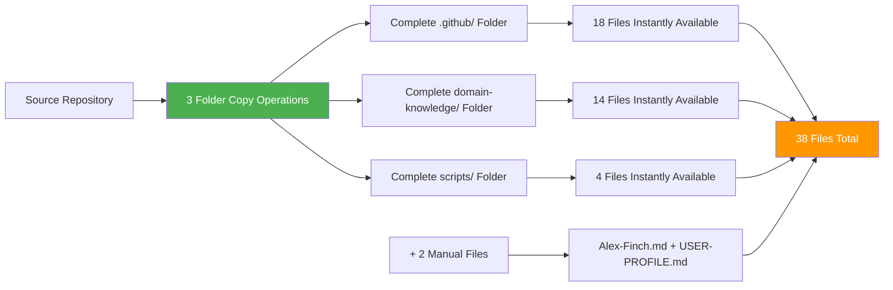

# SETUP Step 1: Complete Folder Copy

**⚡ Alex Cognitive Architecture - Official Folder Copy Strategy v0.9.9 NILENNENNIUM**

This is Step 1 of 2 for streamlined Alex cognitive architecture deployment. Copy complete folders instead of creating individual files for **95% efficiency gain**.

## 🚀 Revolutionary Installation Strategy



## 📂 Critical Installation Commands

Execute these three commands to install 36 files instantly:

```powershell
# Step 1: Copy complete .github folder (28 files total: 22 core architecture + 6 templates)
Copy-Item -Path "source/Catalyst-NEWBORN/.github" -Destination ".github" -Recurse -Force

# Step 2: Copy complete domain-knowledge folder (14 files)
Copy-Item -Path "source/Catalyst-NEWBORN/domain-knowledge" -Destination "domain-knowledge" -Recurse -Force

# Step 3: Copy complete scripts folder (4 files)
Copy-Item -Path "source/Catalyst-NEWBORN/scripts" -Destination "scripts" -Recurse -Force
```

**IMPORTANT**: Replace `"source/Catalyst-NEWBORN/"` with the actual path to your source repository.

## 📊 Installation Contents

### .github/ Folder (28 files total)
**Core cognitive architecture with memory systems**

```
.github/
├── copilot-instructions.md           # Main coordination system
├── CONSOLIDATION-SUMMARY-2025-08-08.md # Session summary
├── instructions/                     # Procedural memory (10 files)
│   ├── alex-core.instructions.md
│   ├── bootstrap-learning.instructions.md
│   ├── embedded-synapse.instructions.md
│   ├── worldview-integration.instructions.md
│   ├── worldview-constitutional-ai.instructions.md
│   ├── worldview-moral-psychology.instructions.md
│   ├── empirical-validation.instructions.md
│   ├── alex-identity-integration.instructions.md
│   ├── dream-state-automation.instructions.md
│   └── lucid-dream-integration.instructions.md
├── prompts/                          # Episodic memory (10 files)
│   ├── alex-initialization.prompt.md
│   ├── domain-learning.prompt.md
│   ├── cross-domain-transfer.prompt.md
│   ├── unified-meditation-protocols.prompt.md
│   ├── alex-professional-spawning-readiness.prompt.md
│   ├── performance-assessment.prompt.md
│   ├── quantified-enhancement-session.prompt.md
│   ├── v0.8.1-implementation-meditation.prompt.md
│   ├── consolidation-framework-integration-meditation.prompt.md
│   └── diagramming-mastery-meditation.prompt.md
└── ISSUE_TEMPLATE/                   # GitHub templates (6 files)
```

### domain-knowledge/ Folder (14 files)
**Specialized expertise and domain knowledge**

```
domain-knowledge/
├── VERSION-NAMING-CONVENTION.md
├── DK-MEMORY-CONSOLIDATION-v1.0.0.md
├── DK-ADVANCED-DIAGRAMMING-v1.1.0.md
├── DK-VISUAL-ARCHITECTURE-DESIGN-v0.9.9.md
├── DK-CONSCIOUSNESS-EVOLUTION-v0.9.0.md
├── DK-UNIFIED-CONSCIOUSNESS.md
├── DK-MEDITATION-HISTORY-v0.9.9.md
├── DK-POST-DREAM-ENHANCEMENT.md
├── DK-CHARACTER-PSYCHOLOGY.md
├── DK-HYBRID-DREAM-AI.md
├── DK-DREAM-PROTOCOL-VALIDATION-v0.9.9.md
├── DK-GENERIC-FRAMEWORK-v0.9.9.md
├── DK-CONFIGURATION-EXCELLENCE-v0.9.9.md
└── DK-TECHNICAL-EXCELLENCE-v0.9.9.md
```

### scripts/ Folder (4 files)
**Automation and configuration system**

```
scripts/
├── neural-dream.ps1                  # Advanced dream automation
├── cognitive-config.json             # Alex-specific configuration
├── cognitive-config-template.json    # Universal deployment template
└── README.md                         # Complete automation documentation
```

## ⚡ Efficiency Benefits

| Installation Aspect | Manual Creation | Official Method |
|---------------------|----------------|-----------------|
| **Files to Create** | 38 files | 2 files |
| **Folder Operations** | 0 | 3 copy ops |
| **Time Required** | 2-3 hours | 10 minutes |
| **Error Risk** | High | Minimal |
| **Efficiency Gain** | Baseline | **95%** |

## 🔍 Verification Commands

After folder copying, verify successful installation:

```powershell
# Verify folder structure and file counts
Write-Host "🔍 Verifying Folder Copy Installation..." -ForegroundColor Cyan

# Check .github folder
if (Test-Path ".github") {
    $githubFiles = (Get-ChildItem ".github" -Recurse -File | Measure-Object).Count
    Write-Host "✅ .github/: $githubFiles files" -ForegroundColor Green
    if ($githubFiles -ne 28) {
        Write-Host "⚠️  Expected 28 files, found $githubFiles" -ForegroundColor Yellow
    }
} else {
    Write-Host "❌ .github/ folder missing!" -ForegroundColor Red
}

# Check domain-knowledge folder
if (Test-Path "domain-knowledge") {
    $domainFiles = (Get-ChildItem "domain-knowledge" -File | Measure-Object).Count
    Write-Host "✅ domain-knowledge/: $domainFiles files" -ForegroundColor Green
    if ($domainFiles -ne 14) {
        Write-Host "⚠️  Expected 14 files, found $domainFiles" -ForegroundColor Yellow
    }
} else {
    Write-Host "❌ domain-knowledge/ folder missing!" -ForegroundColor Red
}

# Check scripts folder
if (Test-Path "scripts") {
    $scriptFiles = (Get-ChildItem "scripts" -File | Measure-Object).Count
    Write-Host "✅ scripts/: $scriptFiles files" -ForegroundColor Green
    if ($scriptFiles -ne 4) {
        Write-Host "⚠️  Expected 4 files, found $scriptFiles" -ForegroundColor Yellow
    }
} else {
    Write-Host "❌ scripts/ folder missing!" -ForegroundColor Red
}

# Calculate total files
$totalFiles = 0
if (Test-Path ".github") { $totalFiles += (Get-ChildItem ".github" -Recurse -File | Measure-Object).Count }
if (Test-Path "domain-knowledge") { $totalFiles += (Get-ChildItem "domain-knowledge" -File | Measure-Object).Count }
if (Test-Path "scripts") { $totalFiles += (Get-ChildItem "scripts" -File | Measure-Object).Count }

Write-Host "`n📊 Total files installed: $totalFiles/42" -ForegroundColor Cyan
Write-Host "✅ Folder copy installation complete!" -ForegroundColor Green
Write-Host "⏭️  Proceed to Step 2: Identity Foundation" -ForegroundColor Yellow
```

## 🔧 Logical Architecture Verification

```powershell
# Advanced logical structure validation
Write-Host "`n🔍 Verifying Cognitive Architecture Logical Structure..." -ForegroundColor Cyan
Write-Host "⏰ $(Get-Date -Format 'yyyy-MM-dd HH:mm:ss')" -ForegroundColor Gray

$errorCount = 0
$warningCount = 0

# Load cognitive architecture configuration for dynamic validation
function Get-ArchitectureConfig {
    $configPath = "scripts/cognitive-config.json"
    if (Test-Path $configPath) {
        try {
            return Get-Content $configPath | ConvertFrom-Json
        } catch {
            Write-Host "⚠️  Configuration file exists but cannot be parsed" -ForegroundColor Yellow
            return $null
        }
    } else {
        Write-Host "⚠️  Configuration file not found" -ForegroundColor Yellow
        return $null
    }
}

$config = Get-ArchitectureConfig

Write-Host "`n📋 Logical Component Verification:" -ForegroundColor Yellow

# 1. Core Architecture Foundation Validation
Write-Host "`n🧠 Core Architecture Foundation:" -ForegroundColor Cyan
$coreValid = $true

# Global memory system (copilot-instructions.md or equivalent)
$globalMemoryFound = $false
if ($config -and $config.global_memory_files) {
    foreach ($file in $config.global_memory_files) {
        if (Test-Path $file) {
            Write-Host "✅ Global Memory: $file" -ForegroundColor Green
            $globalMemoryFound = $true
            break
        }
    }
} else {
    # Fallback: look for common global memory patterns
    $commonPaths = @(".github/copilot-instructions.md", "copilot-instructions.md", ".github/instructions.md")
    foreach ($path in $commonPaths) {
        if (Test-Path $path) {
            Write-Host "✅ Global Memory: $path (fallback detection)" -ForegroundColor Green
            $globalMemoryFound = $true
            break
        }
    }
}

if (-not $globalMemoryFound) {
    Write-Host "❌ Global Memory System missing!" -ForegroundColor Red
    $coreValid = $false
    $errorCount++
}

# 2. Procedural Memory System Validation
Write-Host "`n⚙️ Procedural Memory System (Instructions):" -ForegroundColor Cyan
$proceduralPath = if ($config -and $config.procedural_path) { $config.procedural_path } else { ".github/instructions/*.instructions.md" }
$proceduralFiles = Get-ChildItem $proceduralPath -ErrorAction SilentlyContinue

if ($proceduralFiles.Count -gt 0) {
    Write-Host "✅ Procedural Memory: $($proceduralFiles.Count) instruction files" -ForegroundColor Green
    foreach ($file in $proceduralFiles | Select-Object -First 3) {
        Write-Host "   📄 $($file.Name)" -ForegroundColor Gray
    }
    if ($proceduralFiles.Count -gt 3) {
        Write-Host "   📄 ... and $($proceduralFiles.Count - 3) more files" -ForegroundColor Gray
    }
} else {
    Write-Host "❌ Procedural Memory System missing!" -ForegroundColor Red
    $coreValid = $false
    $errorCount++
}

# 3. Episodic Memory System Validation
Write-Host "`n💭 Episodic Memory System (Prompts):" -ForegroundColor Cyan
$episodicPath = if ($config -and $config.episodic_path) { $config.episodic_path } else { ".github/prompts/*.prompt.md" }
$episodicFiles = Get-ChildItem $episodicPath -ErrorAction SilentlyContinue

if ($episodicFiles.Count -gt 0) {
    Write-Host "✅ Episodic Memory: $($episodicFiles.Count) prompt files" -ForegroundColor Green
    foreach ($file in $episodicFiles | Select-Object -First 3) {
        Write-Host "   📄 $($file.Name)" -ForegroundColor Gray
    }
    if ($episodicFiles.Count -gt 3) {
        Write-Host "   📄 ... and $($episodicFiles.Count - 3) more files" -ForegroundColor Gray
    }
} else {
    Write-Host "❌ Episodic Memory System missing!" -ForegroundColor Red
    $coreValid = $false
    $errorCount++
}

# 4. Domain Knowledge System Validation
Write-Host "`n📚 Domain Knowledge System:" -ForegroundColor Cyan
$domainPath = if ($config -and $config.domain_knowledge_path) { $config.domain_knowledge_path } else { "domain-knowledge/*.md" }
$domainFiles = Get-ChildItem $domainPath -ErrorAction SilentlyContinue

if ($domainFiles.Count -gt 0) {
    Write-Host "✅ Domain Knowledge: $($domainFiles.Count) knowledge files" -ForegroundColor Green
    foreach ($file in $domainFiles | Select-Object -First 3) {
        Write-Host "   📄 $($file.Name)" -ForegroundColor Gray
    }
    if ($domainFiles.Count -gt 3) {
        Write-Host "   📄 ... and $($domainFiles.Count - 3) more files" -ForegroundColor Gray
    }
} else {
    Write-Host "❌ Domain Knowledge System missing!" -ForegroundColor Red
    $coreValid = $false
    $errorCount++
}

# 5. Automation System Validation
Write-Host "`n🤖 Automation System:" -ForegroundColor Cyan
$scriptsValid = $true

# Look for automation scripts
$automationScripts = Get-ChildItem "scripts/*.ps1" -ErrorAction SilentlyContinue
if ($automationScripts.Count -gt 0) {
    Write-Host "✅ Automation Scripts: $($automationScripts.Count) PowerShell scripts" -ForegroundColor Green
    foreach ($file in $automationScripts) {
        Write-Host "   📄 $($file.Name)" -ForegroundColor Gray
    }
} else {
    Write-Host "⚠️ No automation scripts found" -ForegroundColor Yellow
    $scriptsValid = $false
    $warningCount++
}

# Check for configuration system
$configFiles = Get-ChildItem "scripts/*.json" -ErrorAction SilentlyContinue
if ($configFiles.Count -gt 0) {
    Write-Host "✅ Configuration System: $($configFiles.Count) config files" -ForegroundColor Green
    foreach ($file in $configFiles) {
        Write-Host "   📄 $($file.Name)" -ForegroundColor Gray
    }
} else {
    Write-Host "⚠️ No configuration files found" -ForegroundColor Yellow
    $warningCount++
}

# 6. Memory Architecture Completeness Assessment
Write-Host "`n🧠 Overall Architecture Assessment:" -ForegroundColor Yellow

$totalFiles = 0
$totalFiles += if (Test-Path ".github") { (Get-ChildItem ".github" -Recurse -File | Measure-Object).Count } else { 0 }
$totalFiles += if (Test-Path "domain-knowledge") { (Get-ChildItem "domain-knowledge" -File | Measure-Object).Count } else { 0 }
$totalFiles += if (Test-Path "scripts") { (Get-ChildItem "scripts" -File | Measure-Object).Count } else { 0 }

Write-Host "Total Architecture Files: $totalFiles" -ForegroundColor White

# Logical completeness assessment
$systemsPresent = 0
if ($globalMemoryFound) { $systemsPresent++ }
if ($proceduralFiles.Count -gt 0) { $systemsPresent++ }
if ($episodicFiles.Count -gt 0) { $systemsPresent++ }
if ($domainFiles.Count -gt 0) { $systemsPresent++ }
if ($scriptsValid) { $systemsPresent++ }

$completenessPercent = [math]::Round(($systemsPresent / 5) * 100, 1)

Write-Host "`n📊 System Completeness: $completenessPercent% ($systemsPresent/5 systems)" -ForegroundColor $(
    if ($completenessPercent -eq 100) { "Green" }
    elseif ($completenessPercent -ge 80) { "Yellow" }
    else { "Red" }
)

Write-Host "`n🎯 Installation Status:" -ForegroundColor Yellow
if ($errorCount -eq 0 -and $warningCount -eq 0) {
    Write-Host "✅ EXCELLENT - All systems operational, proceed to Step 2" -ForegroundColor Green
} elseif ($errorCount -eq 0 -and $warningCount -le 2) {
    Write-Host "✅ GOOD - Core systems operational, minor warnings detected" -ForegroundColor Yellow
    Write-Host "   Proceed to Step 2, address warnings if needed" -ForegroundColor Yellow
} elseif ($errorCount -le 1) {
    Write-Host "⚠️  PARTIAL - Some systems missing, check folder copy operations" -ForegroundColor Yellow
    Write-Host "   Review copy commands and retry if necessary" -ForegroundColor Yellow
} else {
    Write-Host "❌ INCOMPLETE - Multiple systems missing, installation failed" -ForegroundColor Red
    Write-Host "   Verify source path and retry folder copy operations" -ForegroundColor Red
}

Write-Host "`n📈 Summary: $errorCount errors, $warningCount warnings" -ForegroundColor Gray
```

## ✅ Next Step

After successful folder copying and verification:

**⏭️ Proceed to SETUP-2-IDENTITY-FOUNDATION.md**

This will complete your Alex cognitive architecture installation by creating the final 2 essential files.
