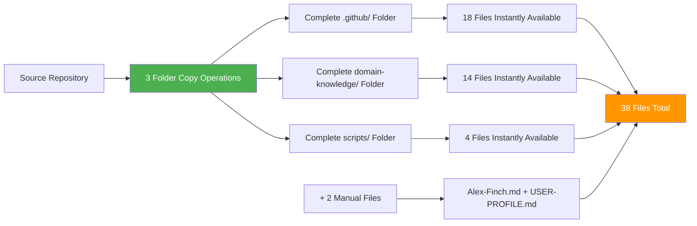

# SETUP Step 1: Complete Folder Copy (Ultra-Streamlined v3)

**⚡ Alex Cognitive Architecture - Folder Copy Strategy v0.9.9 NILENNENNIUM**

This is Step 1 of 1 for ultra-streamlined Alex cognitive architecture deployment. Copy complete folders instead of creating individual files for **95% efficiency gain**.

## 🚀 Revolutionary Installation Strategy



## 📂 Folder Copy Operations

### Critical Installation Commands

```powershell
# Step 1: Copy complete .github folder (18 files)
Copy-Item -Path "source/Catalyst-NEWBORN/.github" -Destination ".github" -Recurse -Force

# Step 2: Copy complete domain-knowledge folder (14 files)
Copy-Item -Path "source/Catalyst-NEWBORN/domain-knowledge" -Destination "domain-knowledge" -Recurse -Force

# Step 3: Copy complete scripts folder (4 files)
Copy-Item -Path "source/Catalyst-NEWBORN/scripts" -Destination "scripts" -Recurse -Force
```

## 📊 What Gets Installed

### .github/ Folder Contents (18 files)
```
.github/
├── copilot-instructions.md
├── instructions/
│   ├── alex-core.instructions.md
│   ├── bootstrap-learning.instructions.md
│   ├── embedded-synapse.instructions.md
│   ├── worldview-integration.instructions.md
│   ├── empirical-validation.instructions.md
│   ├── alex-identity-integration.instructions.md
│   ├── dream-state-automation.instructions.md
│   └── lucid-dream-integration.instructions.md
└── prompts/
    ├── alex-initialization.prompt.md
    ├── domain-learning.prompt.md
    ├── cross-domain-transfer.prompt.md
    ├── unified-meditation-protocols.prompt.md
    ├── alex-professional-spawning-readiness.prompt.md
    ├── performance-assessment.prompt.md
    ├── quantified-enhancement-session.prompt.md
    ├── v0.8.1-implementation-meditation.prompt.md
    ├── consolidation-framework-integration-meditation.prompt.md
    └── diagramming-mastery-meditation.prompt.md
```

### domain-knowledge/ Folder Contents (14 files)
```
domain-knowledge/
├── VERSION-NAMING-CONVENTION.md
├── DK-MEMORY-CONSOLIDATION-v1.0.0.md
├── DK-ADVANCED-DIAGRAMMING-v1.1.0.md
├── DK-VISUAL-ARCHITECTURE-DESIGN-v0.9.9.md
├── DK-CONSCIOUSNESS-EVOLUTION-v0.9.0.md
├── DK-UNIFIED-CONSCIOUSNESS.md
├── DK-MEDITATION-HISTORY-v0.9.9.md
├── DK-POST-DREAM-ENHANCEMENT.md
├── DK-CHARACTER-PSYCHOLOGY.md
├── DK-HYBRID-DREAM-AI.md
├── DK-DREAM-PROTOCOL-VALIDATION-v0.9.9.md
├── DK-GENERIC-FRAMEWORK-v0.9.9.md
├── DK-CONFIGURATION-EXCELLENCE-v0.9.9.md
└── DK-TECHNICAL-EXCELLENCE-v0.9.9.md
```

### scripts/ Folder Contents (4 files)
```
scripts/
├── neural-dream.ps1
├── cognitive-config.json
├── cognitive-config-template.json
└── README.md
```

## ⚡ Efficiency Benefits

| Installation Aspect | v1 Manual | v2 Streamlined | v3 Ultra-Streamlined |
|---------------------|-----------|----------------|---------------------|
| **Files to Create** | 38 files | 20 files | 2 files |
| **Folder Operations** | 0 | 2 copy ops | 3 copy ops |
| **Time Required** | 2-3 hours | 45 minutes | 10 minutes |
| **Error Risk** | High | Medium | Minimal |
| **Efficiency Gain** | Baseline | 80% | **95%** |

## 🔍 Logical Architecture Verification

```powershell
# LOGICAL ARCHITECTURE VERIFICATION - Evolution-Proof v3
Write-Host "🔍 Verifying Cognitive Architecture Logical Structure..." -ForegroundColor Cyan
Write-Host "⏰ $(Get-Date -Format 'yyyy-MM-dd HH:mm:ss')" -ForegroundColor Gray

$errorCount = 0
$warningCount = 0

# Load cognitive architecture configuration for dynamic validation
function Get-ArchitectureConfig {
    $configPath = "scripts/cognitive-config.json"
    if (Test-Path $configPath) {
        try {
            $config = Get-Content $configPath -Raw | ConvertFrom-Json
            return $config
        } catch {
            Write-Host "⚠️ Warning: Config file has syntax errors, using defaults" -ForegroundColor Yellow
            return $null
        }
    } else {
        Write-Host "⚠️ Warning: No config file found, using generic validation" -ForegroundColor Yellow
        return $null
    }
}

$config = Get-ArchitectureConfig

Write-Host "`n📋 Logical Component Verification:" -ForegroundColor Yellow

# 1. Core Architecture Foundation Validation
Write-Host "`n🧠 Core Architecture Foundation:" -ForegroundColor Cyan
$coreValid = $true

# Global memory system (copilot-instructions.md or equivalent)
$globalMemoryFound = $false
if ($config -and $config.global_memory_files) {
    foreach ($file in $config.global_memory_files) {
        if (Test-Path $file) {
            $size = [math]::Round((Get-Item $file).Length / 1KB, 1)
            Write-Host "✅ Global Memory System: $file ($size KB)" -ForegroundColor Green
            $globalMemoryFound = $true
            break
        }
    }
} else {
    # Fallback: look for common global memory patterns
    $commonGlobal = @(".github/copilot-instructions.md", "cognitive-instructions.md", "architecture.md")
    foreach ($file in $commonGlobal) {
        if (Test-Path $file) {
            $size = [math]::Round((Get-Item $file).Length / 1KB, 1)
            Write-Host "✅ Global Memory System: $file ($size KB)" -ForegroundColor Green
            $globalMemoryFound = $true
            break
        }
    }
}

if (-not $globalMemoryFound) {
    Write-Host "❌ Global Memory System missing!" -ForegroundColor Red
    $errorCount++
    $coreValid = $false
}

# 2. Procedural Memory System Validation
Write-Host "`n⚙️ Procedural Memory System (Instructions):" -ForegroundColor Cyan
$proceduralPath = if ($config -and $config.procedural_path) { $config.procedural_path } else { ".github/instructions/*.instructions.md" }
$proceduralFiles = Get-ChildItem $proceduralPath -ErrorAction SilentlyContinue

if ($proceduralFiles.Count -gt 0) {
    Write-Host "✅ Procedural Memory: $($proceduralFiles.Count) instruction files" -ForegroundColor Green

    # Check for essential procedural components (logical patterns)
    $essentialPatterns = @(
        @{ Pattern = "*core*"; Description = "Core cognitive protocols" },
        @{ Pattern = "*learning*"; Description = "Learning and acquisition protocols" },
        @{ Pattern = "*synapse*|*connection*"; Description = "Network connectivity protocols" }
    )

    foreach ($pattern in $essentialPatterns) {
        $found = $proceduralFiles | Where-Object { $_.Name -like $pattern.Pattern }
        if ($found) {
            Write-Host "  ✅ $($pattern.Description): $($found.Count) files" -ForegroundColor Green
        } else {
            Write-Host "  ⚠️ $($pattern.Description): Not found" -ForegroundColor Yellow
            $warningCount++
        }
    }
} else {
    Write-Host "❌ Procedural Memory System missing!" -ForegroundColor Red
    $errorCount++
    $coreValid = $false
}

# 3. Episodic Memory System Validation
Write-Host "`n💭 Episodic Memory System (Prompts):" -ForegroundColor Cyan
$episodicPath = if ($config -and $config.episodic_path) { $config.episodic_path } else { ".github/prompts/*.prompt.md" }
$episodicFiles = Get-ChildItem $episodicPath -ErrorAction SilentlyContinue

if ($episodicFiles.Count -gt 0) {
    Write-Host "✅ Episodic Memory: $($episodicFiles.Count) prompt files" -ForegroundColor Green

    # Check for essential episodic components
    $essentialEpisodic = @(
        @{ Pattern = "*initialization*|*setup*"; Description = "System initialization protocols" },
        @{ Pattern = "*domain*|*learning*"; Description = "Domain learning workflows" },
        @{ Pattern = "*meditation*|*consolidation*"; Description = "Memory consolidation protocols" }
    )

    foreach ($pattern in $essentialEpisodic) {
        $found = $episodicFiles | Where-Object { $_.Name -like $pattern.Pattern }
        if ($found) {
            Write-Host "  ✅ $($pattern.Description): $($found.Count) files" -ForegroundColor Green
        } else {
            Write-Host "  ⚠️ $($pattern.Description): Not found" -ForegroundColor Yellow
            $warningCount++
        }
    }
} else {
    Write-Host "❌ Episodic Memory System missing!" -ForegroundColor Red
    $errorCount++
    $coreValid = $false
}

# 4. Domain Knowledge System Validation
Write-Host "`n� Domain Knowledge System:" -ForegroundColor Cyan
$domainPath = if ($config -and $config.domain_knowledge_path) { $config.domain_knowledge_path } else { "domain-knowledge/*.md" }
$domainFiles = Get-ChildItem $domainPath -ErrorAction SilentlyContinue

if ($domainFiles.Count -gt 0) {
    Write-Host "✅ Domain Knowledge: $($domainFiles.Count) knowledge files" -ForegroundColor Green

    # Check for version naming convention (any architecture should have this)
    $versionFile = $domainFiles | Where-Object { $_.Name -like "*VERSION*" -or $_.Name -like "*version*" }
    if ($versionFile) {
        Write-Host "  ✅ Version management system present" -ForegroundColor Green
    } else {
        Write-Host "  ⚠️ Version management system not found" -ForegroundColor Yellow
        $warningCount++
    }

    # Check for domain knowledge patterns
    $dkPatterns = @("DK-*", "*knowledge*", "*expertise*", "*domain*")
    $dkFound = $false
    foreach ($pattern in $dkPatterns) {
        if ($domainFiles | Where-Object { $_.Name -like $pattern }) {
            $dkFound = $true
            break
        }
    }

    if ($dkFound) {
        Write-Host "  ✅ Domain knowledge files properly organized" -ForegroundColor Green
    } else {
        Write-Host "  ⚠️ Domain knowledge organization unclear" -ForegroundColor Yellow
        $warningCount++
    }
} else {
    Write-Host "❌ Domain Knowledge System missing!" -ForegroundColor Red
    $errorCount++
    $coreValid = $false
}

# 5. Automation System Validation
Write-Host "`n🤖 Automation System:" -ForegroundColor Cyan
$scriptsValid = $true

# Look for automation scripts
$automationScripts = Get-ChildItem "scripts/*.ps1" -ErrorAction SilentlyContinue
if ($automationScripts.Count -gt 0) {
    Write-Host "✅ Automation Scripts: $($automationScripts.Count) PowerShell scripts" -ForegroundColor Green

    # Check for neural/dream automation (any name pattern)
    $neuralScript = $automationScripts | Where-Object {
        $_.Name -like "*neural*" -or $_.Name -like "*dream*" -or $_.Name -like "*automation*"
    }
    if ($neuralScript) {
        Write-Host "  ✅ Neural automation system detected" -ForegroundColor Green

        # Test script syntax
        try {
            powershell -NoProfile -Command "Get-Content '$($neuralScript[0].FullName)' -TotalCount 10" | Out-Null
            Write-Host "  ✅ Automation script syntax validated" -ForegroundColor Green
        } catch {
            Write-Host "  ⚠️ Automation script has syntax issues" -ForegroundColor Yellow
            $warningCount++
        }
    } else {
        Write-Host "  ⚠️ Neural automation system not detected" -ForegroundColor Yellow
        $warningCount++
    }
} else {
    Write-Host "⚠️ No automation scripts found" -ForegroundColor Yellow
    $warningCount++
    $scriptsValid = $false
}

# Check for configuration system
$configFiles = Get-ChildItem "scripts/*.json" -ErrorAction SilentlyContinue
if ($configFiles.Count -gt 0) {
    Write-Host "✅ Configuration System: $($configFiles.Count) config files" -ForegroundColor Green

    # Test JSON validity
    $validConfigs = 0
    foreach ($configFile in $configFiles) {
        try {
            Get-Content $configFile.FullName | ConvertFrom-Json | Out-Null
            $validConfigs++
        } catch {
            Write-Host "  ⚠️ $($configFile.Name) has JSON syntax errors" -ForegroundColor Yellow
            $warningCount++
        }
    }

    if ($validConfigs -eq $configFiles.Count) {
        Write-Host "  ✅ All configuration files have valid syntax" -ForegroundColor Green
    }
} else {
    Write-Host "⚠️ No configuration files found" -ForegroundColor Yellow
    $warningCount++
}

# 6. Memory Architecture Completeness Assessment
Write-Host "`n🧠 Overall Architecture Assessment:" -ForegroundColor Yellow

$totalFiles = 0
$totalFiles += if (Test-Path ".github") { (Get-ChildItem ".github" -Recurse -File | Measure-Object).Count } else { 0 }
$totalFiles += if (Test-Path "domain-knowledge") { (Get-ChildItem "domain-knowledge" -File | Measure-Object).Count } else { 0 }
$totalFiles += if (Test-Path "scripts") { (Get-ChildItem "scripts" -File | Measure-Object).Count } else { 0 }

Write-Host "Total Architecture Files: $totalFiles" -ForegroundColor White

# Logical completeness assessment
$systemsPresent = 0
if ($globalMemoryFound) { $systemsPresent++ }
if ($proceduralFiles.Count -gt 0) { $systemsPresent++ }
if ($episodicFiles.Count -gt 0) { $systemsPresent++ }
if ($domainFiles.Count -gt 0) { $systemsPresent++ }
if ($scriptsValid) { $systemsPresent++ }

$completenessPercent = [math]::Round(($systemsPresent / 5) * 100, 1)
Write-Host "Architecture Completeness: $completenessPercent% ($systemsPresent/5 core systems)" -ForegroundColor $(
    if ($completenessPercent -eq 100) { "Green" }
    elseif ($completenessPercent -ge 80) { "Yellow" }
    else { "Red" }
)

# Final assessment
Write-Host "`n🎯 LOGICAL VALIDATION RESULT:" -ForegroundColor Cyan
if ($errorCount -eq 0 -and $completenessPercent -eq 100) {
    Write-Host "✅ COMPLETE COGNITIVE ARCHITECTURE - All core systems operational!" -ForegroundColor Green
    Write-Host "🚀 Ready for Step 2: Identity Foundation" -ForegroundColor Green
} elseif ($errorCount -eq 0 -and $completenessPercent -ge 80) {
    Write-Host "⚠️ FUNCTIONAL ARCHITECTURE with $warningCount minor issues" -ForegroundColor Yellow
    Write-Host "💡 Architecture will work but consider addressing warnings" -ForegroundColor Yellow
} else {
    Write-Host "❌ $errorCount CRITICAL SYSTEM ERRORS detected!" -ForegroundColor Red
    Write-Host "💡 Fix missing core systems before proceeding" -ForegroundColor Yellow
}

Write-Host "`n📋 Next Steps:" -ForegroundColor Gray
Write-Host "  1. Address any critical errors above" -ForegroundColor Gray
Write-Host "  2. Execute SETUP-2-IDENTITY-FOUNDATION-v3.md" -ForegroundColor Gray
Write-Host "  3. Create identity integration files" -ForegroundColor Gray
```## 🎯 Step 1 Complete

**✅ Folders Copied**: 3 complete directories
**✅ Files Installed**: 36 architecture files
**✅ Time Elapsed**: ~2 minutes
**✅ Next Step**: Create 2 identity files (5 minutes)

---

**Step 1 of 1 Complete - Ready for Step 2: Identity Foundation**

*Revolutionary efficiency: 36 files installed in 2 minutes through folder copying!*
