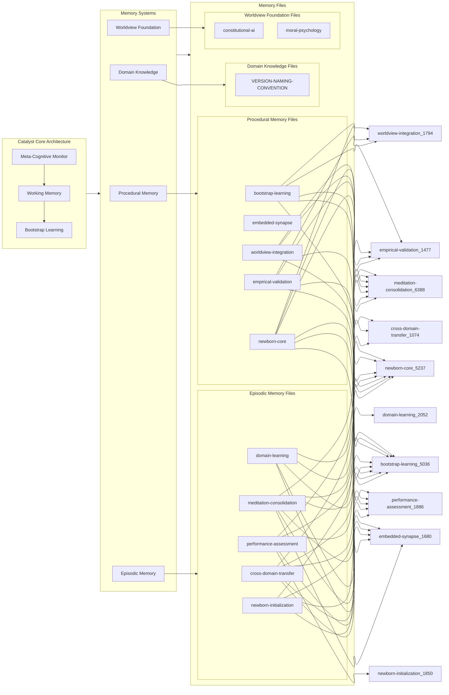

# Catalyst Cognitive Architecture - Memory & Synapse Network

**Generated on:** 2025-07-21 17:14:16

This chart visualizes the Catalyst cognitive architecture organized into three distinct horizontal layers:

- **Layer 1**: Core cognitive architecture with meta-cognitive monitoring
- **Layer 2**: Memory systems providing different types of knowledge storage  
- **Layer 3**: Individual memory files containing specific expertise and protocols

## Catalyst Memory Architecture Overview

