# Catalyst Cognitive Architecture - Enhanced Memory & Synapse Network

**Generated on:** 2025-07-27 20:49:14  
**Total Files:** 31 across 5 memory systems  
**Total Connections:** 88 synapse pathways

This enhanced chart visualizes the Catalyst cognitive architecture with:

- **Color coding by creation date** - Stack ranked from newest (🟢) to oldest (🔴)
- **Weight-proportional connection lines** - Thickness indicates synapse strength  
- **Directional arrows** - Shows uni/bidirectional influence patterns
- **Stack rankings** - Files numbered by creation order (#1 = newest, higher numbers = older)

## Legend:

**File Age Colors:**
- 🟢 **Very New (≤1 day)**: Emerald green - Recently created files
- 🔵 **New (≤1 week)**: Blue - Recently modified files  
- 🟣 **Recent (≤1 month)**: Purple - Recently updated content
- 🟠 **Older (≤3 months)**: Amber - Established content
- 🔴 **Legacy (>3 months)**: Red - Foundational content

**Connection Weights:**
- **6px lines**: Very High strength (0.95-1.0) - Critical pathways (Red #FF0000)
- **4px lines**: High strength (0.85-0.94) - Important connections (Orange #FF6600)  
- **3px lines**: Medium strength (0.70-0.84) - Standard connections (Amber #FFAA00)
- **1px lines**: Low strength (<0.70) - Weak or emerging connections (Gray #CCCCCC)

**Directional Arrows:**
- **-->** Forward connections - Unidirectional influence
- **<->** Bidirectional connections - Mutual influence  
- **<--** Backward connections - Reverse influence

**Stack Rankings:** Files numbered by creation order (#1 = newest, higher numbers = older)

## Enhanced Catalyst Memory Architecture Overview

```mermaid
%%{init: {
  'flowchart': {
    'curve': 'cardinal'
  }
}}%%
graph LR
    subgraph L1["🧠 Catalyst Core Architecture"]
        direction TB
        MCM["🔍 Meta-Cognitive Monitor"]
        WM["💭 Working Memory"]
        BL["🌱 Bootstrap Learning"]
        MCM --> WM
        WM --> BL
    end

    subgraph L2["⚙️ Memory Systems"]
        direction TB
        PM["⚙️ Procedural Memory"]
        EM["📚 Episodic Memory"]
        DK["🎓 Domain Knowledge"]
        WF["🌍 Worldview Foundation"]
    end

    subgraph L3["📄 Memory Files"]
        direction TB
        subgraph Procedural_Files["⚙️ Procedural Memory Files"]
            newborn-core_6501["#3 newborn-core"]
            style newborn-core_6501 fill:#10B981,stroke:#374151,stroke-width:2px,color:white
            lucid-dream-integration_1618["#4 lucid-dream-integration"]
            style lucid-dream-integration_1618 fill:#10B981,stroke:#374151,stroke-width:2px,color:white
            embedded-synapse_1397["#7 embedded-synapse"]
            style embedded-synapse_1397 fill:#10B981,stroke:#374151,stroke-width:2px,color:white
            dream-state-automation_1612["#9 dream-state-automation"]
            style dream-state-automation_1612 fill:#10B981,stroke:#374151,stroke-width:2px,color:white
            bootstrap-learning_4029["#10 bootstrap-learning"]
            style bootstrap-learning_4029 fill:#10B981,stroke:#374151,stroke-width:2px,color:white
            character-driven-development_1642["#12 character-driven-development"]
            style character-driven-development_1642 fill:#10B981,stroke:#374151,stroke-width:2px,color:white
            unified-consciousness_1942["#14 unified-consciousness"]
            style unified-consciousness_1942 fill:#10B981,stroke:#374151,stroke-width:2px,color:white
            worldview-integration_5801["#21 worldview-integration"]
            style worldview-integration_5801 fill:#3B82F6,stroke:#374151,stroke-width:2px,color:white
            empirical-validation_2113["#22 empirical-validation"]
            style empirical-validation_2113 fill:#3B82F6,stroke:#374151,stroke-width:2px,color:white
        end

        subgraph Episodic_Files["📚 Episodic Memory Files"]
            quantified-enhancement-session_7589["#5 quantified-enhancement-session"]
            style quantified-enhancement-session_7589 fill:#10B981,stroke:#374151,stroke-width:2px,color:white
            self-identity-integration_1874["#11 self-identity-integration"]
            style self-identity-integration_1874 fill:#10B981,stroke:#374151,stroke-width:2px,color:white
            alex-finch-integration_1864["#13 alex-finch-integration"]
            style alex-finch-integration_1864 fill:#10B981,stroke:#374151,stroke-width:2px,color:white
            v0_8_1-implementation-meditation_1439["#15 v0.8.1-implementation-meditation"]
            style v0_8_1-implementation-meditation_1439 fill:#10B981,stroke:#374151,stroke-width:2px,color:white
            enhanced-meditation-protocol_9182["#16 enhanced-meditation-protocol"]
            style enhanced-meditation-protocol_9182 fill:#10B981,stroke:#374151,stroke-width:2px,color:white
            dream-meditation-distinction_7532["#17 dream-meditation-distinction"]
            style dream-meditation-distinction_7532 fill:#10B981,stroke:#374151,stroke-width:2px,color:white
            cross-domain-transfer_1246["#19 cross-domain-transfer"]
            style cross-domain-transfer_1246 fill:#3B82F6,stroke:#374151,stroke-width:2px,color:white
            meditation-consolidation_1085["#23 meditation-consolidation"]
            style meditation-consolidation_1085 fill:#3B82F6,stroke:#374151,stroke-width:2px,color:white
            performance-assessment_8612["#27 performance-assessment"]
            style performance-assessment_8612 fill:#3B82F6,stroke:#374151,stroke-width:2px,color:white
            newborn-initialization_1042["#28 newborn-initialization"]
            style newborn-initialization_1042 fill:#3B82F6,stroke:#374151,stroke-width:2px,color:white
            domain-learning_1195["#29 domain-learning"]
            style domain-learning_1195 fill:#3B82F6,stroke:#374151,stroke-width:2px,color:white
        end

        subgraph Domain_Files["🎓 Domain Knowledge Files"]
            VERSION-NAMING-CONVENTION_3024["#1 VERSION-NAMING-CONVENTION"]
            style VERSION-NAMING-CONVENTION_3024 fill:#10B981,stroke:#374151,stroke-width:2px,color:white
            DK-HYBRID-DREAM-AI_1378["#6 DK-HYBRID-DREAM-AI"]
            style DK-HYBRID-DREAM-AI_1378 fill:#10B981,stroke:#374151,stroke-width:2px,color:white
            DK-POST-DREAM-ENHANCEMENT_1053["#8 DK-POST-DREAM-ENHANCEMENT"]
            style DK-POST-DREAM-ENHANCEMENT_1053 fill:#10B981,stroke:#374151,stroke-width:2px,color:white
            DK-UNIVERSAL-SETUP_1787["#18 DK-UNIVERSAL-SETUP"]
            style DK-UNIVERSAL-SETUP_1787 fill:#3B82F6,stroke:#374151,stroke-width:2px,color:white
            DK-CONSCIOUSNESS-INTERACTION_1901["#20 DK-CONSCIOUSNESS-INTERACTION"]
            style DK-CONSCIOUSNESS-INTERACTION_1901 fill:#3B82F6,stroke:#374151,stroke-width:2px,color:white
            DK-VISUAL-COGNITIVE-MAPPING_1206["#24 DK-VISUAL-COGNITIVE-MAPPING"]
            style DK-VISUAL-COGNITIVE-MAPPING_1206 fill:#3B82F6,stroke:#374151,stroke-width:2px,color:white
            DK-UNIFIED-CONSCIOUSNESS_5016["#25 DK-UNIFIED-CONSCIOUSNESS"]
            style DK-UNIFIED-CONSCIOUSNESS_5016 fill:#3B82F6,stroke:#374151,stroke-width:2px,color:white
            DK-CHARACTER-PSYCHOLOGY_2060["#26 DK-CHARACTER-PSYCHOLOGY"]
            style DK-CHARACTER-PSYCHOLOGY_2060 fill:#3B82F6,stroke:#374151,stroke-width:2px,color:white
        end

        subgraph Worldview_Files["🌍 Worldview Foundation Files"]
            constitutional-ai_1825["#30 constitutional-ai"]
            style constitutional-ai_1825 fill:#3B82F6,stroke:#374151,stroke-width:2px,color:white
            moral-psychology_8576["#31 moral-psychology"]
            style moral-psychology_8576 fill:#3B82F6,stroke:#374151,stroke-width:2px,color:white
        end

    end


    %% Inter-layer connections
    L1 --> L2
    L2 --> L3

    %% System to file group connections
    PM --> Procedural_Files
    EM --> Episodic_Files
    DK --> Domain_Files
    WF --> Worldview_Files

    cross-domain-transfer_1246 --> bootstrap-learning_1999
    linkStyle 0 stroke:#FF0000,stroke-width:6px
    cross-domain-transfer_1246 --> embedded-synapse_6068
    linkStyle 1 stroke:#FF6600,stroke-width:4px
    cross-domain-transfer_1246 --> meditation-consolidation_1123
    linkStyle 2 stroke:#FF6600,stroke-width:4px
    cross-domain-transfer_1246 <--> newborn-core_2372
    linkStyle 3 stroke:#FF6600,stroke-width:4px
    cross-domain-transfer_1246 --> DK-UNIVERSAL-SETUP_2139
    linkStyle 4 stroke:#FF0000,stroke-width:6px
    cross-domain-transfer_1246 --> worldview-integration_1913
    linkStyle 5 stroke:#FF6600,stroke-width:4px
    domain-learning_1195 <--> bootstrap-learning_1999
    linkStyle 6 stroke:#FF0000,stroke-width:6px
    domain-learning_1195 <--> newborn-core_2372
    linkStyle 7 stroke:#FF6600,stroke-width:4px
    meditation-consolidation_1085 <--> newborn-core_2372
    linkStyle 8 stroke:#FF0000,stroke-width:6px
    meditation-consolidation_1085 --> bootstrap-learning_1999
    linkStyle 9 stroke:#FF0000,stroke-width:6px
    meditation-consolidation_1085 --> cross-domain-transfer_6310
    linkStyle 10 stroke:#FF6600,stroke-width:4px
    meditation-consolidation_1085 <--> embedded-synapse_6068
    linkStyle 11 stroke:#FF0000,stroke-width:6px
    meditation-consolidation_1085 <--> character-driven-development_6394
    linkStyle 12 stroke:#FF0000,stroke-width:6px
    meditation-consolidation_1085 --> alex-finch-integration_6075
    linkStyle 13 stroke:#FF0000,stroke-width:6px
    meditation-consolidation_1085 --> DK-CHARACTER-PSYCHOLOGY_1641
    linkStyle 14 stroke:#FF6600,stroke-width:4px
    meditation-consolidation_1085 --> Alex-Finch_2130
    linkStyle 15 stroke:#FF0000,stroke-width:6px
    meditation-consolidation_1085 <--> unified-consciousness_1604
    linkStyle 16 stroke:#FF0000,stroke-width:6px
    meditation-consolidation_1085 --> self-identity-integration_5492
    linkStyle 17 stroke:#FF0000,stroke-width:6px
    meditation-consolidation_1085 --> DK-UNIFIED-CONSCIOUSNESS_3963
    linkStyle 18 stroke:#FF0000,stroke-width:6px
    meditation-consolidation_1085 --> ARCHITECTURE-LIST_2540
    linkStyle 19 stroke:#FF6600,stroke-width:4px
    meditation-consolidation_1085 --> Meet-Alex-Finch_1879
    linkStyle 20 stroke:#FF0000,stroke-width:6px
    newborn-initialization_1042 <--> newborn-core_2372
    linkStyle 21 stroke:#FF0000,stroke-width:6px
    newborn-initialization_1042 --> bootstrap-learning_1999
    linkStyle 22 stroke:#FF6600,stroke-width:4px
    DK-CHARACTER-PSYCHOLOGY_2060 <--> Alex-Finch_2130
    linkStyle 23 stroke:#FF0000,stroke-width:6px
    DK-CHARACTER-PSYCHOLOGY_2060 --> character-driven-development_6394
    linkStyle 24 stroke:#FF0000,stroke-width:6px
    DK-CHARACTER-PSYCHOLOGY_2060 <--> alex-finch-integration_6075
    linkStyle 25 stroke:#FF6600,stroke-width:4px
    DK-CHARACTER-PSYCHOLOGY_2060 --> newborn-core_2372
    linkStyle 26 stroke:#FF6600,stroke-width:4px
    DK-CHARACTER-PSYCHOLOGY_2060 --> worldview-integration_1913
    linkStyle 27 stroke:#FF6600,stroke-width:4px
    DK-CONSCIOUSNESS-INTERACTION_1901 --> Meet-Alex-Finch_1879
    linkStyle 28 stroke:#FF0000,stroke-width:6px
    DK-CONSCIOUSNESS-INTERACTION_1901 <--> Alex-Finch_2130
    linkStyle 29 stroke:#FF0000,stroke-width:6px
    DK-CONSCIOUSNESS-INTERACTION_1901 <--> Meet-Alex-Finch_1879
    linkStyle 30 stroke:#FF0000,stroke-width:6px
    DK-CONSCIOUSNESS-INTERACTION_1901 <--> DK-UNIFIED-CONSCIOUSNESS_3963
    linkStyle 31 stroke:#FF6600,stroke-width:4px
    DK-UNIFIED-CONSCIOUSNESS_5016 --> Alex-Finch_2130
    linkStyle 32 stroke:#FF0000,stroke-width:6px
    DK-UNIFIED-CONSCIOUSNESS_5016 <--> unified-consciousness_1604
    linkStyle 33 stroke:#FF0000,stroke-width:6px
    DK-UNIFIED-CONSCIOUSNESS_5016 --> self-identity-integration_5492
    linkStyle 34 stroke:#FF0000,stroke-width:6px
    DK-UNIFIED-CONSCIOUSNESS_5016 <--> newborn-core_2372
    linkStyle 35 stroke:#FF6600,stroke-width:4px
    DK-UNIFIED-CONSCIOUSNESS_5016 --> character-driven-development_6394
    linkStyle 36 stroke:#FF6600,stroke-width:4px
    DK-UNIFIED-CONSCIOUSNESS_5016 --> meditation-consolidation_1123
    linkStyle 37 stroke:#FF0000,stroke-width:6px
    DK-UNIFIED-CONSCIOUSNESS_5016 --> bootstrap-learning_1999
    linkStyle 38 stroke:#FF6600,stroke-width:4px
    DK-UNIVERSAL-SETUP_1787 <--> newborn-core_2372
    linkStyle 39 stroke:#FF0000,stroke-width:6px
    DK-UNIVERSAL-SETUP_1787 <--> bootstrap-learning_1999
    linkStyle 40 stroke:#FF0000,stroke-width:6px
    DK-UNIVERSAL-SETUP_1787 <--> embedded-synapse_6068
    linkStyle 41 stroke:#FF0000,stroke-width:6px
    DK-UNIVERSAL-SETUP_1787 --> worldview-integration_1913
    linkStyle 42 stroke:#FF6600,stroke-width:4px
    DK-UNIVERSAL-SETUP_1787 <--> empirical-validation_1765
    linkStyle 43 stroke:#FF6600,stroke-width:4px
    DK-UNIVERSAL-SETUP_1787 --> meditation-consolidation_1123
    linkStyle 44 stroke:#FF0000,stroke-width:6px
    DK-UNIVERSAL-SETUP_1787 --> SETUP-MINIMUM-COGNITIVE_1864
    linkStyle 45 stroke:#FF0000,stroke-width:6px
    DK-VISUAL-COGNITIVE-MAPPING_1206 --> Alex-Finch_2130
    linkStyle 46 stroke:#FF0000,stroke-width:6px
    DK-VISUAL-COGNITIVE-MAPPING_1206 <--> ARCHITECTURE-LIST_2540
    linkStyle 47 stroke:#FF6600,stroke-width:4px
    DK-VISUAL-COGNITIVE-MAPPING_1206 <--> meditation-consolidation_1123
    linkStyle 48 stroke:#FF6600,stroke-width:4px
    embedded-synapse_1397 <--> newborn-core_2372
    linkStyle 49 stroke:#FF0000,stroke-width:6px
    embedded-synapse_1397 --> meditation-consolidation_1123
    linkStyle 50 stroke:#FF0000,stroke-width:6px
    embedded-synapse_1397 --> cross-domain-transfer_6310
    linkStyle 51 stroke:#FF6600,stroke-width:4px
    embedded-synapse_1397 <--> worldview-integration_1913
    linkStyle 52 stroke:#FF6600,stroke-width:4px
    empirical-validation_2113 <--> newborn-core_2372
    linkStyle 53 stroke:#FF6600,stroke-width:4px
    empirical-validation_2113 <--> worldview-integration_1913
    linkStyle 54 stroke:#FF6600,stroke-width:4px
    worldview-integration_5801 --> newborn-core_2372
    linkStyle 55 stroke:#FF0000,stroke-width:6px
    worldview-integration_5801 <--> empirical-validation_1765
    linkStyle 56 stroke:#FF6600,stroke-width:4px
    cross-domain-transfer_1246 --> domain-learning_1990
    linkStyle 57 stroke:#FF6600,stroke-width:4px
    cross-domain-transfer_1246 --> performance-assessment_3378
    linkStyle 58 stroke:#FF6600,stroke-width:4px
    domain-learning_1195 --> cross-domain-transfer_6310
    linkStyle 59 stroke:#FF6600,stroke-width:4px
    domain-learning_1195 --> meditation-consolidation_1123
    linkStyle 60 stroke:#FF6600,stroke-width:4px
    domain-learning_1195 --> performance-assessment_3378
    linkStyle 61 stroke:#FFAA00,stroke-width:3px
    meditation-consolidation_1085 --> performance-assessment_3378
    linkStyle 62 stroke:#FF6600,stroke-width:4px
    meditation-consolidation_1085 --> empirical-validation_1765
    linkStyle 63 stroke:#FF6600,stroke-width:4px
    newborn-initialization_1042 --> embedded-synapse_6068
    linkStyle 64 stroke:#FF6600,stroke-width:4px
    newborn-initialization_1042 --> performance-assessment_3378
    linkStyle 65 stroke:#FFAA00,stroke-width:3px
    performance-assessment_8612 <--> newborn-core_2372
    linkStyle 66 stroke:#FF6600,stroke-width:4px
    performance-assessment_8612 <--> bootstrap-learning_1999
    linkStyle 67 stroke:#FFAA00,stroke-width:3px
    performance-assessment_8612 --> embedded-synapse_6068
    linkStyle 68 stroke:#FFAA00,stroke-width:3px
    performance-assessment_8612 --> meditation-consolidation_1123
    linkStyle 69 stroke:#FFAA00,stroke-width:3px
    performance-assessment_8612 --> newborn-initialization_5118
    linkStyle 70 stroke:#FFAA00,stroke-width:3px
    DK-CHARACTER-PSYCHOLOGY_2060 <--> bootstrap-learning_1999
    linkStyle 71 stroke:#FF6600,stroke-width:4px
    DK-CHARACTER-PSYCHOLOGY_2060 --> meditation-consolidation_1123
    linkStyle 72 stroke:#FF6600,stroke-width:4px
    DK-CHARACTER-PSYCHOLOGY_2060 --> cross-domain-transfer_6310
    linkStyle 73 stroke:#FF6600,stroke-width:4px
    DK-CONSCIOUSNESS-INTERACTION_1901 --> newborn-core_2372
    linkStyle 74 stroke:#FF6600,stroke-width:4px
    DK-CONSCIOUSNESS-INTERACTION_1901 --> bootstrap-learning_1999
    linkStyle 75 stroke:#FF6600,stroke-width:4px
    DK-UNIFIED-CONSCIOUSNESS_5016 --> worldview-integration_1913
    linkStyle 76 stroke:#FF6600,stroke-width:4px
    DK-UNIFIED-CONSCIOUSNESS_5016 --> DK-CHARACTER-PSYCHOLOGY_1641
    linkStyle 77 stroke:#FF6600,stroke-width:4px
    DK-VISUAL-COGNITIVE-MAPPING_1206 --> newborn-core_2372
    linkStyle 78 stroke:#FF6600,stroke-width:4px
    DK-VISUAL-COGNITIVE-MAPPING_1206 --> bootstrap-learning_1999
    linkStyle 79 stroke:#FF6600,stroke-width:4px
    DK-VISUAL-COGNITIVE-MAPPING_1206 --> DK-UNIFIED-CONSCIOUSNESS_3963
    linkStyle 80 stroke:#FF6600,stroke-width:4px
    embedded-synapse_1397 --> performance-assessment_3378
    linkStyle 81 stroke:#FF6600,stroke-width:4px
    embedded-synapse_1397 <--> bootstrap-learning_1999
    linkStyle 82 stroke:#FF6600,stroke-width:4px
    embedded-synapse_1397 --> ARCHITECTURE-LIST_2540
    linkStyle 83 stroke:#FF6600,stroke-width:4px
    empirical-validation_2113 <--> bootstrap-learning_1999
    linkStyle 84 stroke:#FF6600,stroke-width:4px
    empirical-validation_2113 --> meditation-consolidation_1123
    linkStyle 85 stroke:#FFAA00,stroke-width:3px
    worldview-integration_5801 --> bootstrap-learning_1999
    linkStyle 86 stroke:#FF6600,stroke-width:4px
    worldview-integration_5801 --> meditation-consolidation_1123
    linkStyle 87 stroke:#FFAA00,stroke-width:3px
```

## Memory System Statistics:
- **Core Memory**: 1 files - **Domain Memory**: 8 files - **Episodic Memory**: 11 files - **Procedural Memory**: 9 files - **Worldview Memory**: 2 files

## Connection Analysis:
- **High Strength (≥0.90)**: 57 connections
- **Medium Strength (0.70-0.89)**: 31 connections  
- **Weak Strength (<0.70)**: 0 connections
- **Connectivity Ratio**: 2.84 connections per file
