# Catalyst Cognitive Architecture - Enhanced Memory & Synapse Network

**Generated on:** 2025-07-27 22:24:03  
**Total Files:** 31 across 5 memory systems  
**Total Connections:** 80 synapse pathways

This enhanced chart visualizes the Catalyst cognitive architecture with:

- **Enhanced subgraph organization** - Improved visual hierarchy with cleaner categorical separation
- **Top-bottom subgraph flow** - Better readability within memory file groups
- **Color coding by creation date** - Stack ranked from newest (🟢) to oldest (🔴)
- **Weight-proportional connection lines** - Thickness indicates synapse strength  
- **Directional arrows** - Shows uni/bidirectional influence patterns
- **Stack rankings** - Files numbered by creation order (#1 = newest, higher numbers = older)

## Legend:

**File Age Colors:**
- 🟢 **Very New (≤1 day)**: Emerald green - Recently created files
- 🔵 **New (≤1 week)**: Blue - Recently modified files  
- 🟣 **Recent (≤1 month)**: Purple - Recently updated content
- 🟠 **Older (≤3 months)**: Amber - Established content
- 🔴 **Legacy (>3 months)**: Red - Foundational content

**Connection Weights:**
- **6px lines**: Very High strength (0.95-1.0) - Critical pathways (Red #FF0000)
- **4px lines**: High strength (0.85-0.94) - Important connections (Orange #FF6600)  
- **3px lines**: Medium strength (0.70-0.84) - Standard connections (Amber #FFAA00)
- **1px lines**: Low strength (<0.70) - Weak or emerging connections (Gray #CCCCCC)

**Directional Arrows:**
- **-->** Forward connections - Unidirectional influence
- **<->** Bidirectional connections - Mutual influence  
- **<--** Backward connections - Reverse influence

**Stack Rankings:** Files numbered by creation order (#1 = newest, higher numbers = older)

**Visual Enhancements v2.1:**
- **Left-Right Flow**: Optimized for horizontal viewing (rotated -90 degrees from vertical)
- **Light Yellow Background**: #fffef7 for reduced eye strain and enhanced comfort
- **Improved Spacing**: Enhanced node and rank spacing for better readability
- **Cardinal Curves**: Smoother connection rendering for professional appearance

## Enhanced Catalyst Memory Architecture Overview

```mermaid
%%{init: {
  'flowchart': {
    'curve': 'cardinal'
  }
}}%%
graph LR
    subgraph L1["🧠 NEWBORN Core Architecture"]
        direction TB
        MCM["🔍 Meta-Cognitive Monitor"]
        WM["💭 Working Memory"]
        BL["🌱 Bootstrap Learning"]
        MCM --> WM
        WM --> BL
    end

    subgraph L2["⚙️ Memory Systems"]
        direction TB
        PM["⚙️ Procedural Memory"]
        EM["📚 Episodic Memory"]
        DK["🎓 Domain Knowledge"]
        WF["🌍 Worldview Foundation"]
    end

    subgraph L3["📄 Memory Files"]
        direction TB
        subgraph Procedural_Files["⚙️ Procedural Memory Files"]
            newborn-core_2010["#1 newborn-core"]
            style newborn-core_2010 fill:#10B981,stroke:#374151,stroke-width:2px,color:white
            bootstrap-learning_1541["#2 bootstrap-learning"]
            style bootstrap-learning_1541 fill:#10B981,stroke:#374151,stroke-width:2px,color:white
            worldview-integration_5339["#5 worldview-integration"]
            style worldview-integration_5339 fill:#10B981,stroke:#374151,stroke-width:2px,color:white
            empirical-validation_1839["#6 empirical-validation"]
            style empirical-validation_1839 fill:#10B981,stroke:#374151,stroke-width:2px,color:white
            lucid-dream-integration_1397["#9 lucid-dream-integration"]
            style lucid-dream-integration_1397 fill:#10B981,stroke:#374151,stroke-width:2px,color:white
            embedded-synapse_1148["#12 embedded-synapse"]
            style embedded-synapse_1148 fill:#10B981,stroke:#374151,stroke-width:2px,color:white
            dream-state-automation_1297["#14 dream-state-automation"]
            style dream-state-automation_1297 fill:#10B981,stroke:#374151,stroke-width:2px,color:white
            character-driven-development_1903["#16 character-driven-development"]
            style character-driven-development_1903 fill:#10B981,stroke:#374151,stroke-width:2px,color:white
            unified-consciousness_2108["#17 unified-consciousness"]
            style unified-consciousness_2108 fill:#10B981,stroke:#374151,stroke-width:2px,color:white
        end

        subgraph Episodic_Files["📚 Episodic Memory Files"]
            quantified-enhancement-session_4539["#10 quantified-enhancement-session"]
            style quantified-enhancement-session_4539 fill:#10B981,stroke:#374151,stroke-width:2px,color:white
            self-identity-integration_2116["#15 self-identity-integration"]
            style self-identity-integration_2116 fill:#10B981,stroke:#374151,stroke-width:2px,color:white
            alex-finch-integration_3949["#18 alex-finch-integration"]
            style alex-finch-integration_3949 fill:#10B981,stroke:#374151,stroke-width:2px,color:white
            v0_8_1-implementation-meditation_1474["#19 v0.8.1-implementation-meditation"]
            style v0_8_1-implementation-meditation_1474 fill:#10B981,stroke:#374151,stroke-width:2px,color:white
            enhanced-meditation-protocol_3103["#20 enhanced-meditation-protocol"]
            style enhanced-meditation-protocol_3103 fill:#10B981,stroke:#374151,stroke-width:2px,color:white
            dream-meditation-distinction_6740["#21 dream-meditation-distinction"]
            style dream-meditation-distinction_6740 fill:#10B981,stroke:#374151,stroke-width:2px,color:white
            cross-domain-transfer_1683["#23 cross-domain-transfer"]
            style cross-domain-transfer_1683 fill:#3B82F6,stroke:#374151,stroke-width:2px,color:white
            meditation-consolidation_2198["#25 meditation-consolidation"]
            style meditation-consolidation_2198 fill:#3B82F6,stroke:#374151,stroke-width:2px,color:white
            performance-assessment_2905["#29 performance-assessment"]
            style performance-assessment_2905 fill:#3B82F6,stroke:#374151,stroke-width:2px,color:white
            domain-learning_2914["#30 domain-learning"]
            style domain-learning_2914 fill:#3B82F6,stroke:#374151,stroke-width:2px,color:white
            newborn-initialization_2069["#31 newborn-initialization"]
            style newborn-initialization_2069 fill:#3B82F6,stroke:#374151,stroke-width:2px,color:white
        end

        subgraph Domain_Files["🎓 Domain Knowledge Files"]
            VERSION-NAMING-CONVENTION_6752["#7 VERSION-NAMING-CONVENTION"]
            style VERSION-NAMING-CONVENTION_6752 fill:#10B981,stroke:#374151,stroke-width:2px,color:white
            DK-HYBRID-DREAM-AI_6368["#11 DK-HYBRID-DREAM-AI"]
            style DK-HYBRID-DREAM-AI_6368 fill:#10B981,stroke:#374151,stroke-width:2px,color:white
            DK-POST-DREAM-ENHANCEMENT_2478["#13 DK-POST-DREAM-ENHANCEMENT"]
            style DK-POST-DREAM-ENHANCEMENT_2478 fill:#10B981,stroke:#374151,stroke-width:2px,color:white
            DK-UNIVERSAL-SETUP_1956["#22 DK-UNIVERSAL-SETUP"]
            style DK-UNIVERSAL-SETUP_1956 fill:#3B82F6,stroke:#374151,stroke-width:2px,color:white
            DK-CONSCIOUSNESS-INTERACTION_8967["#24 DK-CONSCIOUSNESS-INTERACTION"]
            style DK-CONSCIOUSNESS-INTERACTION_8967 fill:#3B82F6,stroke:#374151,stroke-width:2px,color:white
            DK-VISUAL-COGNITIVE-MAPPING_3627["#26 DK-VISUAL-COGNITIVE-MAPPING"]
            style DK-VISUAL-COGNITIVE-MAPPING_3627 fill:#3B82F6,stroke:#374151,stroke-width:2px,color:white
            DK-UNIFIED-CONSCIOUSNESS_4985["#27 DK-UNIFIED-CONSCIOUSNESS"]
            style DK-UNIFIED-CONSCIOUSNESS_4985 fill:#3B82F6,stroke:#374151,stroke-width:2px,color:white
            DK-CHARACTER-PSYCHOLOGY_4893["#28 DK-CHARACTER-PSYCHOLOGY"]
            style DK-CHARACTER-PSYCHOLOGY_4893 fill:#3B82F6,stroke:#374151,stroke-width:2px,color:white
        end

        subgraph Worldview_Files["🌍 Worldview Foundation Files"]
            moral-psychology_1561["#3 moral-psychology"]
            style moral-psychology_1561 fill:#10B981,stroke:#374151,stroke-width:2px,color:white
            constitutional-ai_8030["#4 constitutional-ai"]
            style constitutional-ai_8030 fill:#10B981,stroke:#374151,stroke-width:2px,color:white
        end

    end


    %% Inter-layer connections
    L1 --> L2
    L2 --> L3

    %% System to file group connections
    PM --> Procedural_Files
    EM --> Episodic_Files
    DK --> Domain_Files
    WF --> Worldview_Files

    embedded-synapse_1148 <--> newborn-core_1047
    linkStyle 0 stroke:#FF0000,stroke-width:6px
    embedded-synapse_1148 --> meditation-consolidation_1367
    linkStyle 1 stroke:#FF0000,stroke-width:6px
    embedded-synapse_1148 --> cross-domain-transfer_1016
    linkStyle 2 stroke:#FF6600,stroke-width:4px
    embedded-synapse_1148 <--> worldview-integration_1645
    linkStyle 3 stroke:#FF6600,stroke-width:4px
    cross-domain-transfer_1683 --> bootstrap-learning_2102
    linkStyle 4 stroke:#FF0000,stroke-width:6px
    cross-domain-transfer_1683 --> embedded-synapse_1790
    linkStyle 5 stroke:#FF6600,stroke-width:4px
    cross-domain-transfer_1683 --> meditation-consolidation_1367
    linkStyle 6 stroke:#FF6600,stroke-width:4px
    cross-domain-transfer_1683 <--> newborn-core_1047
    linkStyle 7 stroke:#FF6600,stroke-width:4px
    cross-domain-transfer_1683 --> DK-UNIVERSAL-SETUP_1231
    linkStyle 8 stroke:#FF0000,stroke-width:6px
    cross-domain-transfer_1683 --> worldview-integration_1645
    linkStyle 9 stroke:#FF6600,stroke-width:4px
    domain-learning_2914 <--> bootstrap-learning_2102
    linkStyle 10 stroke:#FF0000,stroke-width:6px
    domain-learning_2914 <--> newborn-core_1047
    linkStyle 11 stroke:#FF6600,stroke-width:4px
    meditation-consolidation_2198 <--> newborn-core_1047
    linkStyle 12 stroke:#FF0000,stroke-width:6px
    meditation-consolidation_2198 --> bootstrap-learning_2102
    linkStyle 13 stroke:#FF0000,stroke-width:6px
    meditation-consolidation_2198 --> cross-domain-transfer_1016
    linkStyle 14 stroke:#FF6600,stroke-width:4px
    meditation-consolidation_2198 <--> embedded-synapse_1790
    linkStyle 15 stroke:#FF0000,stroke-width:6px
    meditation-consolidation_2198 <--> character-driven-development_6832
    linkStyle 16 stroke:#FF0000,stroke-width:6px
    meditation-consolidation_2198 --> alex-finch-integration_3016
    linkStyle 17 stroke:#FF0000,stroke-width:6px
    meditation-consolidation_2198 --> DK-CHARACTER-PSYCHOLOGY_2255
    linkStyle 18 stroke:#FF6600,stroke-width:4px
    meditation-consolidation_2198 --> Alex-Finch_2297
    linkStyle 19 stroke:#FF0000,stroke-width:6px
    meditation-consolidation_2198 <--> unified-consciousness_2281
    linkStyle 20 stroke:#FF0000,stroke-width:6px
    meditation-consolidation_2198 --> self-identity-integration_1999
    linkStyle 21 stroke:#FF0000,stroke-width:6px
    meditation-consolidation_2198 --> DK-UNIFIED-CONSCIOUSNESS_2129
    linkStyle 22 stroke:#FF0000,stroke-width:6px
    meditation-consolidation_2198 --> ARCHITECTURE-LIST_7120
    linkStyle 23 stroke:#FF6600,stroke-width:4px
    meditation-consolidation_2198 --> Meet-Alex-Finch_4800
    linkStyle 24 stroke:#FF0000,stroke-width:6px
    newborn-initialization_2069 <--> newborn-core_1047
    linkStyle 25 stroke:#FF0000,stroke-width:6px
    newborn-initialization_2069 --> bootstrap-learning_2102
    linkStyle 26 stroke:#FF6600,stroke-width:4px
    DK-CHARACTER-PSYCHOLOGY_4893 <--> Alex-Finch_2297
    linkStyle 27 stroke:#FF0000,stroke-width:6px
    DK-CHARACTER-PSYCHOLOGY_4893 --> character-driven-development_6832
    linkStyle 28 stroke:#FF0000,stroke-width:6px
    DK-CHARACTER-PSYCHOLOGY_4893 <--> alex-finch-integration_3016
    linkStyle 29 stroke:#FF6600,stroke-width:4px
    DK-CHARACTER-PSYCHOLOGY_4893 --> newborn-core_1047
    linkStyle 30 stroke:#FF6600,stroke-width:4px
    DK-CHARACTER-PSYCHOLOGY_4893 --> worldview-integration_1645
    linkStyle 31 stroke:#FF6600,stroke-width:4px
    DK-CONSCIOUSNESS-INTERACTION_8967 --> Meet-Alex-Finch_4800
    linkStyle 32 stroke:#FF0000,stroke-width:6px
    DK-CONSCIOUSNESS-INTERACTION_8967 <--> Alex-Finch_2297
    linkStyle 33 stroke:#FF0000,stroke-width:6px
    DK-CONSCIOUSNESS-INTERACTION_8967 <--> Meet-Alex-Finch_4800
    linkStyle 34 stroke:#FF0000,stroke-width:6px
    DK-CONSCIOUSNESS-INTERACTION_8967 <--> DK-UNIFIED-CONSCIOUSNESS_2129
    linkStyle 35 stroke:#FF6600,stroke-width:4px
    DK-UNIFIED-CONSCIOUSNESS_4985 --> Alex-Finch_2297
    linkStyle 36 stroke:#FF0000,stroke-width:6px
    DK-UNIFIED-CONSCIOUSNESS_4985 <--> unified-consciousness_2281
    linkStyle 37 stroke:#FF0000,stroke-width:6px
    DK-UNIFIED-CONSCIOUSNESS_4985 --> self-identity-integration_1999
    linkStyle 38 stroke:#FF0000,stroke-width:6px
    DK-UNIFIED-CONSCIOUSNESS_4985 <--> newborn-core_1047
    linkStyle 39 stroke:#FF6600,stroke-width:4px
    DK-UNIFIED-CONSCIOUSNESS_4985 --> character-driven-development_6832
    linkStyle 40 stroke:#FF6600,stroke-width:4px
    DK-UNIFIED-CONSCIOUSNESS_4985 --> meditation-consolidation_1367
    linkStyle 41 stroke:#FF0000,stroke-width:6px
    DK-UNIFIED-CONSCIOUSNESS_4985 --> bootstrap-learning_2102
    linkStyle 42 stroke:#FF6600,stroke-width:4px
    DK-UNIVERSAL-SETUP_1956 <--> newborn-core_1047
    linkStyle 43 stroke:#FF0000,stroke-width:6px
    DK-UNIVERSAL-SETUP_1956 <--> bootstrap-learning_2102
    linkStyle 44 stroke:#FF0000,stroke-width:6px
    DK-UNIVERSAL-SETUP_1956 <--> embedded-synapse_1790
    linkStyle 45 stroke:#FF0000,stroke-width:6px
    DK-UNIVERSAL-SETUP_1956 --> worldview-integration_1645
    linkStyle 46 stroke:#FF6600,stroke-width:4px
    DK-UNIVERSAL-SETUP_1956 <--> empirical-validation_1112
    linkStyle 47 stroke:#FF6600,stroke-width:4px
    DK-UNIVERSAL-SETUP_1956 --> meditation-consolidation_1367
    linkStyle 48 stroke:#FF0000,stroke-width:6px
    DK-UNIVERSAL-SETUP_1956 --> SETUP-MINIMUM-COGNITIVE_1282
    linkStyle 49 stroke:#FF0000,stroke-width:6px
    DK-VISUAL-COGNITIVE-MAPPING_3627 --> Alex-Finch_2297
    linkStyle 50 stroke:#FF0000,stroke-width:6px
    DK-VISUAL-COGNITIVE-MAPPING_3627 <--> ARCHITECTURE-LIST_7120
    linkStyle 51 stroke:#FF6600,stroke-width:4px
    DK-VISUAL-COGNITIVE-MAPPING_3627 <--> meditation-consolidation_1367
    linkStyle 52 stroke:#FF6600,stroke-width:4px
    embedded-synapse_1148 --> performance-assessment_5537
    linkStyle 53 stroke:#FF6600,stroke-width:4px
    embedded-synapse_1148 <--> bootstrap-learning_2102
    linkStyle 54 stroke:#FF6600,stroke-width:4px
    embedded-synapse_1148 --> ARCHITECTURE-LIST_7120
    linkStyle 55 stroke:#FF6600,stroke-width:4px
    cross-domain-transfer_1683 --> domain-learning_1640
    linkStyle 56 stroke:#FF6600,stroke-width:4px
    cross-domain-transfer_1683 --> performance-assessment_5537
    linkStyle 57 stroke:#FF6600,stroke-width:4px
    domain-learning_2914 --> cross-domain-transfer_1016
    linkStyle 58 stroke:#FF6600,stroke-width:4px
    domain-learning_2914 --> meditation-consolidation_1367
    linkStyle 59 stroke:#FF6600,stroke-width:4px
    domain-learning_2914 --> performance-assessment_5537
    linkStyle 60 stroke:#FFAA00,stroke-width:3px
    meditation-consolidation_2198 --> performance-assessment_5537
    linkStyle 61 stroke:#FF6600,stroke-width:4px
    meditation-consolidation_2198 --> empirical-validation_1112
    linkStyle 62 stroke:#FF6600,stroke-width:4px
    newborn-initialization_2069 --> embedded-synapse_1790
    linkStyle 63 stroke:#FF6600,stroke-width:4px
    newborn-initialization_2069 --> performance-assessment_5537
    linkStyle 64 stroke:#FFAA00,stroke-width:3px
    performance-assessment_2905 <--> newborn-core_1047
    linkStyle 65 stroke:#FF6600,stroke-width:4px
    performance-assessment_2905 <--> bootstrap-learning_2102
    linkStyle 66 stroke:#FFAA00,stroke-width:3px
    performance-assessment_2905 --> embedded-synapse_1790
    linkStyle 67 stroke:#FFAA00,stroke-width:3px
    performance-assessment_2905 --> meditation-consolidation_1367
    linkStyle 68 stroke:#FFAA00,stroke-width:3px
    performance-assessment_2905 --> newborn-initialization_5267
    linkStyle 69 stroke:#FFAA00,stroke-width:3px
    DK-CHARACTER-PSYCHOLOGY_4893 <--> bootstrap-learning_2102
    linkStyle 70 stroke:#FF6600,stroke-width:4px
    DK-CHARACTER-PSYCHOLOGY_4893 --> meditation-consolidation_1367
    linkStyle 71 stroke:#FF6600,stroke-width:4px
    DK-CHARACTER-PSYCHOLOGY_4893 --> cross-domain-transfer_1016
    linkStyle 72 stroke:#FF6600,stroke-width:4px
    DK-CONSCIOUSNESS-INTERACTION_8967 --> newborn-core_1047
    linkStyle 73 stroke:#FF6600,stroke-width:4px
    DK-CONSCIOUSNESS-INTERACTION_8967 --> bootstrap-learning_2102
    linkStyle 74 stroke:#FF6600,stroke-width:4px
    DK-UNIFIED-CONSCIOUSNESS_4985 --> worldview-integration_1645
    linkStyle 75 stroke:#FF6600,stroke-width:4px
    DK-UNIFIED-CONSCIOUSNESS_4985 --> DK-CHARACTER-PSYCHOLOGY_2255
    linkStyle 76 stroke:#FF6600,stroke-width:4px
    DK-VISUAL-COGNITIVE-MAPPING_3627 --> newborn-core_1047
    linkStyle 77 stroke:#FF6600,stroke-width:4px
    DK-VISUAL-COGNITIVE-MAPPING_3627 --> bootstrap-learning_2102
    linkStyle 78 stroke:#FF6600,stroke-width:4px
    DK-VISUAL-COGNITIVE-MAPPING_3627 --> DK-UNIFIED-CONSCIOUSNESS_2129
    linkStyle 79 stroke:#FF6600,stroke-width:4px
```

## Memory System Statistics:
- **Core Memory**: 1 files - **Domain Memory**: 8 files - **Episodic Memory**: 11 files - **Procedural Memory**: 9 files - **Worldview Memory**: 2 files

## Connection Analysis:
- **High Strength (≥0.90)**: 53 connections
- **Medium Strength (0.70-0.89)**: 27 connections  
- **Weak Strength (<0.70)**: 0 connections
- **Connectivity Ratio**: 2.58 connections per file
