# Catalyst Cognitive Architecture - Enhanced Memory & Synapse Network

**Generated on:** 2025-07-27 23:19:01  
**Total Files:** 31 across 5 memory systems  
**Total Connections:** 80 synapse pathways

This enhanced chart visualizes the Catalyst cognitive architecture with:

- **Optimal LR→TB flow** - Main layers flow left-to-right (L1→L2→L3) with top-to-bottom organization within each layer
- **Enhanced subgraph organization** - Improved visual hierarchy with cleaner categorical separation
- **Color coding by creation date** - Stack ranked from newest (🟢) to oldest (🔴)
- **Weight-proportional connection lines** - Thickness indicates synapse strength  
- **Directional arrows** - Shows uni/bidirectional influence patterns
- **Stack rankings** - Files numbered by creation order (#1 = newest, higher numbers = older)

## Legend:

**File Age Colors:**
- 🟢 **Very New (≤1 day)**: Emerald green - Recently created files
- 🔵 **New (≤1 week)**: Blue - Recently modified files  
- 🟣 **Recent (≤1 month)**: Purple - Recently updated content
- 🟠 **Older (≤3 months)**: Amber - Established content
- 🔴 **Legacy (>3 months)**: Red - Foundational content

**Connection Weights:**
- **6px lines**: Very High strength (0.95-1.0) - Critical pathways (Red #FF0000)
- **4px lines**: High strength (0.85-0.94) - Important connections (Orange #FF6600)  
- **3px lines**: Medium strength (0.70-0.84) - Standard connections (Amber #FFAA00)
- **1px lines**: Low strength (<0.70) - Weak or emerging connections (Gray #CCCCCC)

**Directional Arrows:**
- **-->** Forward connections - Unidirectional influence
- **<->** Bidirectional connections - Mutual influence  
- **<--** Backward connections - Reverse influence

**Stack Rankings:** Files numbered by creation order (#1 = newest, higher numbers = older)

**Visual Enhancements v2.1:**
- **Optimal LR→TB Flow**: Main layers flow left-to-right (L1→L2→L3) with top-to-bottom organization within layers
- **Enhanced Subgraph Organization**: Internal TB direction within each layer for optimal readability
- **Improved Spacing**: Enhanced node and rank spacing for better visual hierarchy
- **Cardinal Curves**: Smoother connection rendering for professional appearance

## Enhanced Catalyst Memory Architecture Overview

```mermaid
%%{init: {
  'flowchart': {
    'curve': 'cardinal',
    'useMaxWidth': true
  }
}}%%
graph LR
    subgraph L1["Catalyst Core Architecture"]
        direction TB
        MCM["Meta-Cognitive Monitor"]
        WM["Working Memory"]
        BL["Bootstrap Learning"]
        MCM --> WM
        WM --> BL
    end

    subgraph L2["Memory Systems"]
        direction TB
        PM["Procedural Memory"]
        EM["Episodic Memory"]
        DK["Domain Knowledge"]
        WF["Worldview Foundation"]
    end

    subgraph L3["Memory Files - Color Coded by Creation Date"]
        direction TB
        subgraph Worldview_Files["🌍 Worldview Foundation Files"]
            constitutional-ai_1668["🟢 constitutional-ai #2"]
            style constitutional-ai_1668 fill:#10B981,stroke:#374151,stroke-width:2px,color:white
            moral-psychology_1898["🟢 moral-psychology #3"]
            style moral-psychology_1898 fill:#10B981,stroke:#374151,stroke-width:2px,color:white
        end

        subgraph Domain_Files["🎯 Domain Knowledge Files"]
            VERSION-NAMING-CONVENTION_2957["🟢 VERSION-NAMING-CONVENTION #7"]
            style VERSION-NAMING-CONVENTION_2957 fill:#10B981,stroke:#374151,stroke-width:2px,color:white
            DK-HYBRID-DREAM-AI_1033["🟢 DK-HYBRID-DREAM-AI #11"]
            style DK-HYBRID-DREAM-AI_1033 fill:#10B981,stroke:#374151,stroke-width:2px,color:white
            DK-POST-DREAM-ENHANCEMENT_6057["🟢 DK-POST-DREAM-ENHANCEMENT #13"]
            style DK-POST-DREAM-ENHANCEMENT_6057 fill:#10B981,stroke:#374151,stroke-width:2px,color:white
            DK-UNIVERSAL-SETUP_7954["🔵 DK-UNIVERSAL-SETUP #22"]
            style DK-UNIVERSAL-SETUP_7954 fill:#3B82F6,stroke:#374151,stroke-width:2px,color:white
            DK-CONSCIOUSNESS-INTERACTION_9795["🔵 DK-CONSCIOUSNESS-INTERACTION #24"]
            style DK-CONSCIOUSNESS-INTERACTION_9795 fill:#3B82F6,stroke:#374151,stroke-width:2px,color:white
            DK-VISUAL-COGNITIVE-MAPPING_1781["🔵 DK-VISUAL-COGNITIVE-MAPPING #26"]
            style DK-VISUAL-COGNITIVE-MAPPING_1781 fill:#3B82F6,stroke:#374151,stroke-width:2px,color:white
            DK-UNIFIED-CONSCIOUSNESS_6396["🔵 DK-UNIFIED-CONSCIOUSNESS #27"]
            style DK-UNIFIED-CONSCIOUSNESS_6396 fill:#3B82F6,stroke:#374151,stroke-width:2px,color:white
            DK-CHARACTER-PSYCHOLOGY_1984["🔵 DK-CHARACTER-PSYCHOLOGY #28"]
            style DK-CHARACTER-PSYCHOLOGY_1984 fill:#3B82F6,stroke:#374151,stroke-width:2px,color:white
        end

        subgraph Procedural_Files["🔧 Procedural Memory Files"]
            newborn-core_1868["🟢 newborn-core #1"]
            style newborn-core_1868 fill:#10B981,stroke:#374151,stroke-width:2px,color:white
            worldview-integration_2124["🟢 worldview-integration #4"]
            style worldview-integration_2124 fill:#10B981,stroke:#374151,stroke-width:2px,color:white
            empirical-validation_2878["🟢 empirical-validation #5"]
            style empirical-validation_2878 fill:#10B981,stroke:#374151,stroke-width:2px,color:white
            bootstrap-learning_1879["🟢 bootstrap-learning #6"]
            style bootstrap-learning_1879 fill:#10B981,stroke:#374151,stroke-width:2px,color:white
            lucid-dream-integration_1226["🟢 lucid-dream-integration #9"]
            style lucid-dream-integration_1226 fill:#10B981,stroke:#374151,stroke-width:2px,color:white
            embedded-synapse_7524["🟢 embedded-synapse #12"]
            style embedded-synapse_7524 fill:#10B981,stroke:#374151,stroke-width:2px,color:white
            dream-state-automation_9683["🟢 dream-state-automation #14"]
            style dream-state-automation_9683 fill:#10B981,stroke:#374151,stroke-width:2px,color:white
            unified-consciousness_1998["🟢 unified-consciousness #16"]
            style unified-consciousness_1998 fill:#10B981,stroke:#374151,stroke-width:2px,color:white
            character-driven-development_1492["🟢 character-driven-development #18"]
            style character-driven-development_1492 fill:#10B981,stroke:#374151,stroke-width:2px,color:white
        end

        subgraph Episodic_Files["📖 Episodic Memory Files"]
            quantified-enhancement-session_8863["🟢 quantified-enhancement-session #10"]
            style quantified-enhancement-session_8863 fill:#10B981,stroke:#374151,stroke-width:2px,color:white
            self-identity-integration_1240["🟢 self-identity-integration #15"]
            style self-identity-integration_1240 fill:#10B981,stroke:#374151,stroke-width:2px,color:white
            alex-finch-integration_1211["🟢 alex-finch-integration #17"]
            style alex-finch-integration_1211 fill:#10B981,stroke:#374151,stroke-width:2px,color:white
            v0_8_1-implementation-meditation_7272["🟢 v0.8.1-implementation-meditation #19"]
            style v0_8_1-implementation-meditation_7272 fill:#10B981,stroke:#374151,stroke-width:2px,color:white
            dream-meditation-distinction_1960["🟢 dream-meditation-distinction #20"]
            style dream-meditation-distinction_1960 fill:#10B981,stroke:#374151,stroke-width:2px,color:white
            enhanced-meditation-protocol_1173["🟢 enhanced-meditation-protocol #21"]
            style enhanced-meditation-protocol_1173 fill:#10B981,stroke:#374151,stroke-width:2px,color:white
            cross-domain-transfer_1932["🔵 cross-domain-transfer #23"]
            style cross-domain-transfer_1932 fill:#3B82F6,stroke:#374151,stroke-width:2px,color:white
            meditation-consolidation_2033["🔵 meditation-consolidation #25"]
            style meditation-consolidation_2033 fill:#3B82F6,stroke:#374151,stroke-width:2px,color:white
            performance-assessment_3547["🔵 performance-assessment #29"]
            style performance-assessment_3547 fill:#3B82F6,stroke:#374151,stroke-width:2px,color:white
            domain-learning_1073["🔵 domain-learning #30"]
            style domain-learning_1073 fill:#3B82F6,stroke:#374151,stroke-width:2px,color:white
            newborn-initialization_1843["🔵 newborn-initialization #31"]
            style newborn-initialization_1843 fill:#3B82F6,stroke:#374151,stroke-width:2px,color:white
        end

    end



    %% Inter-layer connections
    L1 --> L2
    L2 --> L3

    %% System to file group connections
    PM --> Procedural_Files
    EM --> Episodic_Files
    DK --> Domain_Files
    WF --> Worldview_Files

    DK-CHARACTER-PSYCHOLOGY_1984 <--> Alex-Finch_1609
    linkStyle 0 stroke:#FF0000,stroke-width:6px
    DK-CHARACTER-PSYCHOLOGY_1984 --> character-driven-development_4916
    linkStyle 1 stroke:#FF0000,stroke-width:6px
    DK-CHARACTER-PSYCHOLOGY_1984 <--> alex-finch-integration_8151
    linkStyle 2 stroke:#FF6600,stroke-width:4px
    DK-CHARACTER-PSYCHOLOGY_1984 --> newborn-core_1670
    linkStyle 3 stroke:#FF6600,stroke-width:4px
    DK-CHARACTER-PSYCHOLOGY_1984 --> worldview-integration_1434
    linkStyle 4 stroke:#FF6600,stroke-width:4px
    DK-CONSCIOUSNESS-INTERACTION_9795 --> Meet-Alex-Finch_3047
    linkStyle 5 stroke:#FF0000,stroke-width:6px
    DK-CONSCIOUSNESS-INTERACTION_9795 <--> Alex-Finch_1609
    linkStyle 6 stroke:#FF0000,stroke-width:6px
    DK-CONSCIOUSNESS-INTERACTION_9795 <--> Meet-Alex-Finch_3047
    linkStyle 7 stroke:#FF0000,stroke-width:6px
    DK-CONSCIOUSNESS-INTERACTION_9795 <--> DK-UNIFIED-CONSCIOUSNESS_1022
    linkStyle 8 stroke:#FF6600,stroke-width:4px
    DK-UNIFIED-CONSCIOUSNESS_6396 --> Alex-Finch_1609
    linkStyle 9 stroke:#FF0000,stroke-width:6px
    DK-UNIFIED-CONSCIOUSNESS_6396 <--> unified-consciousness_1057
    linkStyle 10 stroke:#FF0000,stroke-width:6px
    DK-UNIFIED-CONSCIOUSNESS_6396 --> self-identity-integration_2146
    linkStyle 11 stroke:#FF0000,stroke-width:6px
    DK-UNIFIED-CONSCIOUSNESS_6396 <--> newborn-core_1670
    linkStyle 12 stroke:#FF6600,stroke-width:4px
    DK-UNIFIED-CONSCIOUSNESS_6396 --> character-driven-development_4916
    linkStyle 13 stroke:#FF6600,stroke-width:4px
    DK-UNIFIED-CONSCIOUSNESS_6396 --> meditation-consolidation_4257
    linkStyle 14 stroke:#FF0000,stroke-width:6px
    DK-UNIFIED-CONSCIOUSNESS_6396 --> bootstrap-learning_2120
    linkStyle 15 stroke:#FF6600,stroke-width:4px
    DK-UNIVERSAL-SETUP_7954 <--> newborn-core_1670
    linkStyle 16 stroke:#FF0000,stroke-width:6px
    DK-UNIVERSAL-SETUP_7954 <--> bootstrap-learning_2120
    linkStyle 17 stroke:#FF0000,stroke-width:6px
    DK-UNIVERSAL-SETUP_7954 <--> embedded-synapse_1830
    linkStyle 18 stroke:#FF0000,stroke-width:6px
    DK-UNIVERSAL-SETUP_7954 --> worldview-integration_1434
    linkStyle 19 stroke:#FF6600,stroke-width:4px
    DK-UNIVERSAL-SETUP_7954 <--> empirical-validation_1836
    linkStyle 20 stroke:#FF6600,stroke-width:4px
    DK-UNIVERSAL-SETUP_7954 --> meditation-consolidation_4257
    linkStyle 21 stroke:#FF0000,stroke-width:6px
    DK-UNIVERSAL-SETUP_7954 --> SETUP-MINIMUM-COGNITIVE_1487
    linkStyle 22 stroke:#FF0000,stroke-width:6px
    DK-VISUAL-COGNITIVE-MAPPING_1781 --> Alex-Finch_1609
    linkStyle 23 stroke:#FF0000,stroke-width:6px
    DK-VISUAL-COGNITIVE-MAPPING_1781 <--> ARCHITECTURE-LIST_7535
    linkStyle 24 stroke:#FF6600,stroke-width:4px
    DK-VISUAL-COGNITIVE-MAPPING_1781 <--> meditation-consolidation_4257
    linkStyle 25 stroke:#FF6600,stroke-width:4px
    embedded-synapse_7524 <--> newborn-core_1670
    linkStyle 26 stroke:#FF0000,stroke-width:6px
    embedded-synapse_7524 --> meditation-consolidation_4257
    linkStyle 27 stroke:#FF0000,stroke-width:6px
    embedded-synapse_7524 --> cross-domain-transfer_1201
    linkStyle 28 stroke:#FF6600,stroke-width:4px
    embedded-synapse_7524 <--> worldview-integration_1434
    linkStyle 29 stroke:#FF6600,stroke-width:4px
    cross-domain-transfer_1932 --> bootstrap-learning_2120
    linkStyle 30 stroke:#FF0000,stroke-width:6px
    cross-domain-transfer_1932 --> embedded-synapse_1830
    linkStyle 31 stroke:#FF6600,stroke-width:4px
    cross-domain-transfer_1932 --> meditation-consolidation_4257
    linkStyle 32 stroke:#FF6600,stroke-width:4px
    cross-domain-transfer_1932 <--> newborn-core_1670
    linkStyle 33 stroke:#FF6600,stroke-width:4px
    cross-domain-transfer_1932 --> DK-UNIVERSAL-SETUP_4555
    linkStyle 34 stroke:#FF0000,stroke-width:6px
    cross-domain-transfer_1932 --> worldview-integration_1434
    linkStyle 35 stroke:#FF6600,stroke-width:4px
    domain-learning_1073 <--> bootstrap-learning_2120
    linkStyle 36 stroke:#FF0000,stroke-width:6px
    domain-learning_1073 <--> newborn-core_1670
    linkStyle 37 stroke:#FF6600,stroke-width:4px
    meditation-consolidation_2033 <--> newborn-core_1670
    linkStyle 38 stroke:#FF0000,stroke-width:6px
    meditation-consolidation_2033 --> bootstrap-learning_2120
    linkStyle 39 stroke:#FF0000,stroke-width:6px
    meditation-consolidation_2033 --> cross-domain-transfer_1201
    linkStyle 40 stroke:#FF6600,stroke-width:4px
    meditation-consolidation_2033 <--> embedded-synapse_1830
    linkStyle 41 stroke:#FF0000,stroke-width:6px
    meditation-consolidation_2033 <--> character-driven-development_4916
    linkStyle 42 stroke:#FF0000,stroke-width:6px
    meditation-consolidation_2033 --> alex-finch-integration_8151
    linkStyle 43 stroke:#FF0000,stroke-width:6px
    meditation-consolidation_2033 --> DK-CHARACTER-PSYCHOLOGY_1327
    linkStyle 44 stroke:#FF6600,stroke-width:4px
    meditation-consolidation_2033 --> Alex-Finch_1609
    linkStyle 45 stroke:#FF0000,stroke-width:6px
    meditation-consolidation_2033 <--> unified-consciousness_1057
    linkStyle 46 stroke:#FF0000,stroke-width:6px
    meditation-consolidation_2033 --> self-identity-integration_2146
    linkStyle 47 stroke:#FF0000,stroke-width:6px
    meditation-consolidation_2033 --> DK-UNIFIED-CONSCIOUSNESS_1022
    linkStyle 48 stroke:#FF0000,stroke-width:6px
    meditation-consolidation_2033 --> ARCHITECTURE-LIST_7535
    linkStyle 49 stroke:#FF6600,stroke-width:4px
    meditation-consolidation_2033 --> Meet-Alex-Finch_3047
    linkStyle 50 stroke:#FF0000,stroke-width:6px
    newborn-initialization_1843 <--> newborn-core_1670
    linkStyle 51 stroke:#FF0000,stroke-width:6px
    newborn-initialization_1843 --> bootstrap-learning_2120
    linkStyle 52 stroke:#FF6600,stroke-width:4px
    DK-CHARACTER-PSYCHOLOGY_1984 <--> bootstrap-learning_2120
    linkStyle 53 stroke:#FF6600,stroke-width:4px
    DK-CHARACTER-PSYCHOLOGY_1984 --> meditation-consolidation_4257
    linkStyle 54 stroke:#FF6600,stroke-width:4px
    DK-CHARACTER-PSYCHOLOGY_1984 --> cross-domain-transfer_1201
    linkStyle 55 stroke:#FF6600,stroke-width:4px
    DK-CONSCIOUSNESS-INTERACTION_9795 --> newborn-core_1670
    linkStyle 56 stroke:#FF6600,stroke-width:4px
    DK-CONSCIOUSNESS-INTERACTION_9795 --> bootstrap-learning_2120
    linkStyle 57 stroke:#FF6600,stroke-width:4px
    DK-UNIFIED-CONSCIOUSNESS_6396 --> worldview-integration_1434
    linkStyle 58 stroke:#FF6600,stroke-width:4px
    DK-UNIFIED-CONSCIOUSNESS_6396 --> DK-CHARACTER-PSYCHOLOGY_1327
    linkStyle 59 stroke:#FF6600,stroke-width:4px
    DK-VISUAL-COGNITIVE-MAPPING_1781 --> newborn-core_1670
    linkStyle 60 stroke:#FF6600,stroke-width:4px
    DK-VISUAL-COGNITIVE-MAPPING_1781 --> bootstrap-learning_2120
    linkStyle 61 stroke:#FF6600,stroke-width:4px
    DK-VISUAL-COGNITIVE-MAPPING_1781 --> DK-UNIFIED-CONSCIOUSNESS_1022
    linkStyle 62 stroke:#FF6600,stroke-width:4px
    embedded-synapse_7524 --> performance-assessment_1038
    linkStyle 63 stroke:#FF6600,stroke-width:4px
    embedded-synapse_7524 <--> bootstrap-learning_2120
    linkStyle 64 stroke:#FF6600,stroke-width:4px
    embedded-synapse_7524 --> ARCHITECTURE-LIST_7535
    linkStyle 65 stroke:#FF6600,stroke-width:4px
    cross-domain-transfer_1932 --> domain-learning_8131
    linkStyle 66 stroke:#FF6600,stroke-width:4px
    cross-domain-transfer_1932 --> performance-assessment_1038
    linkStyle 67 stroke:#FF6600,stroke-width:4px
    domain-learning_1073 --> cross-domain-transfer_1201
    linkStyle 68 stroke:#FF6600,stroke-width:4px
    domain-learning_1073 --> meditation-consolidation_4257
    linkStyle 69 stroke:#FF6600,stroke-width:4px
    domain-learning_1073 --> performance-assessment_1038
    linkStyle 70 stroke:#FFAA00,stroke-width:3px
    meditation-consolidation_2033 --> performance-assessment_1038
    linkStyle 71 stroke:#FF6600,stroke-width:4px
    meditation-consolidation_2033 --> empirical-validation_1836
    linkStyle 72 stroke:#FF6600,stroke-width:4px
    newborn-initialization_1843 --> embedded-synapse_1830
    linkStyle 73 stroke:#FF6600,stroke-width:4px
    newborn-initialization_1843 --> performance-assessment_1038
    linkStyle 74 stroke:#FFAA00,stroke-width:3px
    performance-assessment_3547 <--> newborn-core_1670
    linkStyle 75 stroke:#FF6600,stroke-width:4px
    performance-assessment_3547 <--> bootstrap-learning_2120
    linkStyle 76 stroke:#FFAA00,stroke-width:3px
    performance-assessment_3547 --> embedded-synapse_1830
    linkStyle 77 stroke:#FFAA00,stroke-width:3px
    performance-assessment_3547 --> meditation-consolidation_4257
    linkStyle 78 stroke:#FFAA00,stroke-width:3px
    performance-assessment_3547 --> newborn-initialization_1563
    linkStyle 79 stroke:#FFAA00,stroke-width:3px
```

## Memory System Statistics:
- **Core Memory**: 1 files - **Domain Memory**: 8 files - **Episodic Memory**: 11 files - **Procedural Memory**: 9 files - **Worldview Memory**: 2 files

## Connection Analysis:
- **High Strength (≥0.90)**: 53 connections
- **Medium Strength (0.70-0.89)**: 27 connections  
- **Weak Strength (<0.70)**: 0 connections
- **Connectivity Ratio**: 2.58 connections per file
